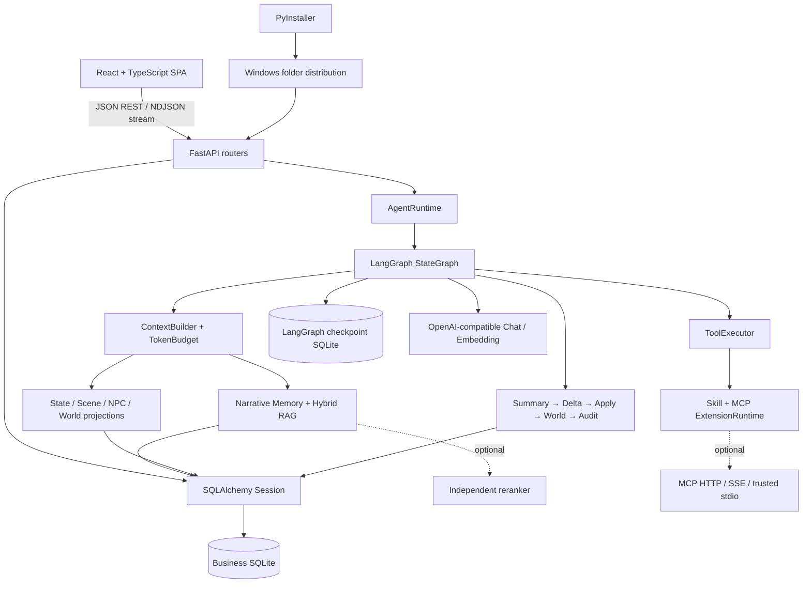
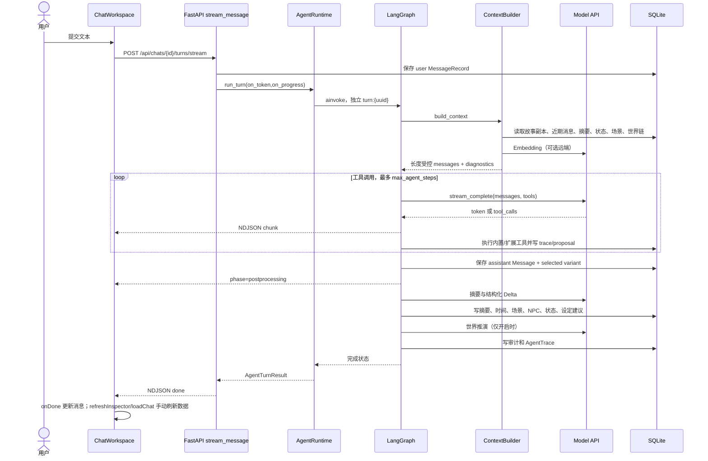

# Saraswati Agent 项目完整交接档案

> 适用对象：简历撰写、技术面试、新 Codex/开发者接手。
> 核验基线：`main` / `ce7476c` / `v1.4.0`，核验日期 2026-08-11。
> 证据标记：**[事实]** 可由当前代码、Git 或本次命令直接证明；**[推断]** 是基于实现的合理结论；**[待确认]** 需要项目作者补充，不能直接写成事实。

## 1. 项目一句话介绍

### 30 字以内版本

本地长篇角色扮演 Agent 客户端，维护可回放的剧情记忆与设定。

### 简历版本

Saraswati Agent 是一个 React + FastAPI 的本地长篇角色扮演客户端，通过 LangGraph 编排模型、工具、分层记忆、剧情状态和生成后审计，并用事件回放保证候选回复、故事分支与角色/世界设定的一致性。

### 面试自我介绍版本

我做的是一个面向长篇角色扮演的本地 AI Agent 客户端。它不只保存聊天记录，还把每轮剧情拆成摘要、时间线、场景、NPC、状态和重大设定变化。核心难点是：用户改写消息、切换候选回复或创建分支后，派生数据不能继续引用旧剧情。项目采用 LangGraph 编排生成流程，以消息指纹和候选 ID 标记派生记录，并通过事件重放重建当前投影；同时提供混合 RAG、Token 预算、OpenAI 兼容接口、SillyTavern 数据兼容和受限插件运行时。当前以 Windows 本地单用户使用为目标，尚不是云端多租户系统。

## 2. 项目背景与解决的问题

### 使用场景

- **[事实]** 用户在本地维护角色、主控人物、世界书和写作预设模板，创建故事时复制为故事私有副本；证据：`backend/routers/stories.py::create_chat`、`backend/controller_helpers.py::_copy_character_to_story/_copy_persona_to_story/_copy_world_to_story`。
- **[事实]** 用户与 OpenAI-compatible 模型进行长篇角色扮演，支持流式回复、候选重生成、消息改写、分支和检查点；证据：`backend/routers/stories.py`、`frontend/src/pages/ChatWorkspace.tsx`。
- **[事实]** 系统在生成后维护摘要、检索记忆、时间线、场景/NPC、精确状态、世界推演和重大设定变更；证据：`backend/services/agent_graph.py::build_agent_graph`。
- **[事实]** 支持 SillyTavern V2 角色卡、世界书、Chat Completion 预设的兼容数据，以及本地前端插件；证据：`backend/serializers.py`、`backend/services/presets.py`、`docs/frontend-plugins.md`。

### 目标用户

- **[代码与产品文档共同支持]** 希望在本地进行长篇角色扮演、并在意设定连续性和资料可控性的个人用户。
- **[待确认]** 是否已有真实外部用户、用户画像访谈、留存或使用频率数据。仓库没有埋点、账号或分析平台，不能声称已有用户规模。

### 核心痛点

1. 长对话超出上下文窗口，模型忘记早期事件。
2. 原始聊天、摘要、状态和场景同时存在时容易相互矛盾。
3. 重生成、改写和分支会让旧候选产生的派生数据污染当前剧情。
4. 传统角色卡/世界书通常是静态资料；故事中已经完成的复仇、势力覆灭、身份转变等重大结果无法谨慎回写当前故事设定。
5. 第三方角色卡和插件生态数据格式复杂，需要兼容但不能让不可信代码直接进入主进程。

### 项目范围

- **包含：** 本地单机 Web 客户端、SQLite 持久化、模型适配、Agent 编排、记忆和状态、SillyTavern 兼容、Skill/MCP/前端插件、Windows 目录式发布包。
- **不包含：** 用户账号、远程鉴权、云同步、多租户、计费、分布式队列、容器编排、模型训练、通用向量数据库、移动端、正式安装器。证据：`README.md`“开发状态”、`docs/PROJECT_SPEC.md`。

### 当前完成度

- **[事实]** v1.4.0 已发布，Git 标签 `v1.4.0` 指向 `ce7476c`；当前 `main` 与 `origin/main` 同步。
- **[事实]** 本次核验：71 项 pytest 通过；前端 TypeScript + Vite 构建通过；固定 RAG 集 5 个样例通过；300 轮长上下文模拟通过。
- **[推断]** 对“本地可演示 MVP/个人工具”已形成完整闭环；对“可公开运营的生产 SaaS”完成度较低，因为缺少鉴权、并发控制、备份、监控、负载测试和部署体系。

## 3. 技术栈

| 分类 | 技术/框架 | 本项目实际用途 | 选择原因（代码可推断） | 代码证据 | 面试可能追问 |
| --- | --- | --- | --- | --- | --- |
| 核心后端 | Python 3.13 | 业务服务、模型适配、迁移、打包入口 | 生态覆盖 FastAPI、LangGraph、模型与数据处理 | `.github/workflows/ci.yml`、`saraswati_launcher.py` | 3.13 兼容性；同步 ORM 放在 async 路由的影响 |
| 核心 API | FastAPI + Pydantic | REST/NDJSON API、依赖注入、请求响应校验、OpenAPI | 类型契约清楚，便于 TestClient 回归 | `backend/main.py`、`backend/routers/*`、`backend/schemas.py` | 为什么不用 WebSocket；异常如何映射；是否有全局中间件 |
| 核心 ORM | SQLAlchemy 2.x | SQLite 表模型、事务和查询 | 统一模型层并与 Alembic 元数据协作 | `backend/database.py`、`backend/models.py` | Session 生命周期；N+1；并发写；事务边界 |
| 核心数据库 | SQLite | 聊天、模板、记忆、状态、事件和审计的本地持久化 | 单机零运维，适合目录式桌面分发 | `backend/config.py::_default_data_dir`、`backend/models.py` | 写锁、备份、WAL、数据量上限、迁移到 Postgres |
| 数据库演进 | Alembic | 0001～0008 结构迁移，启动自动升级，CI 校验 metadata | 避免继续依赖临时 ALTER，兼容旧库 | `backend/migrations.py`、`alembic/versions/*`、CI | legacy stamp 为什么安全；downgrade 能力 |
| Agent 编排 | LangGraph StateGraph | 工具循环、后处理节点、条件路由、节点检查点 | 显式状态机比单函数更易追踪和恢复 | `backend/services/agent_graph.py::build_agent_graph` | 图状态和运行时依赖为什么分开；thread_id 设计 |
| 检查点 | langgraph-checkpoint-sqlite + aiosqlite | 每轮独立 thread 的节点状态持久化；无路径时内存回退 | 本地持久化且不把 Session/API Key 序列化 | `backend/services/agent.py::startup/run_turn/_safe_serializer` | 检查点与业务数据库为何分离；当前是否真正支持恢复 |
| 模型访问 | httpx + tenacity | OpenAI-compatible completion、stream、embedding、rerank；选择性重试 | 异步流式请求、连接复用、对暂时故障重试 | `backend/providers/openai_compatible.py`、`backend/reranker.py` | 幂等性；哪些错误不能重试；兼容差异如何降级 |
| 长期记忆 | 自研混合 RAG + JSON 向量 | 多视角查询；余弦/Jaccard/重要度/时间加权；可选 rerank | MVP 不引入独立向量库，检索原因可解释 | `backend/services/memory.py` | O(n) 扫描成本；权重依据；评估集是否可信 |
| Token 管理 | tiktoken + 启发式回退 | 已知模型分词、未知模型保守估算、上下文裁剪与诊断 | 兼顾 OpenAI 系和兼容供应商 | `backend/services/token_budget.py` | 消息格式开销未完全计入；未知模型估算误差 |
| 扩展协议 | MCP Python SDK | Streamable HTTP、SSE、受信任 stdio 工具发现与调用 | 复用标准工具协议，避免每个服务写专用适配 | `backend/extensions/plugins.py`、`backend/extensions/runtime.py` | stdio 信任边界；进程监督；OAuth 尚缺失 |
| Skill | PyYAML + 自研注册表 | 解析 `SKILL.md` frontmatter、按需读取、故事级 allowlist | 渐进披露，减少常驻上下文 | `backend/extensions/skills.py` | ZIP 安全、路径逃逸、为何不执行 Skill 脚本 |
| 核心前端 | React 19 + TypeScript | 单页工作区、资料库、设置、记忆控制台 | 组件生态和类型约束适合复杂交互 | `frontend/src/App.tsx`、`frontend/src/pages/ChatWorkspace.tsx` | 大组件拆分、错误边界、状态边界 |
| 服务端状态 | TanStack Query | bootstrap/chat snapshot 查询；工作区再用手动刷新同步局部数据 | 复用查询生命周期，同时保留流式 UI 的即时状态 | `frontend/src/hooks/useWorkspaceQueries.ts`、`ChatWorkspace.tsx` | 为什么 chat snapshot 一次并发 19 个请求；为何没有统一 `invalidateQueries` |
| 前端构建 | Vite + TypeScript compiler | 开发服务器、生产构建、静态资源哈希 | 构建快、与 React 集成简单 | `frontend/package.json`、`frontend/vite.config.ts` | 包体、分包、浏览器兼容性 |
| 流式传输 | NDJSON over Fetch | user/chunk/phase/done/error 事件；AbortController 停止 | 比 SSE 更容易使用 POST body，比 WebSocket 简单 | `backend/routers/stories.py::stream_message`、`frontend/src/api.ts::streamTurn` | 断线恢复、背压、代理缓冲、为何不用 SSE |
| Windows 分发 | PyInstaller | 打包 FastAPI、前端 dist、Alembic、内置插件为目录式程序 | 用户无需 Python/Node；保留本地 Web 架构 | `SaraswatiAgent.spec`、`scripts/build_windows.ps1` | 为什么不是 one-file；杀毒误报；升级策略 |
| CI | GitHub Actions | Windows 上迁移检查、pytest、npm build | 与目标运行平台一致 | `.github/workflows/ci.yml` | 没有发布自动化、缓存和矩阵测试的代价 |
| 测试 | pytest + FastAPI TestClient | API、图路由、迁移、可靠性、扩展安全、世界推演回归 | 能隔离模型并验证数据副作用 | `tests/*` | fake model 与真实供应商差距；缺少 E2E/负载测试 |

### 已安装且确有使用

`fastapi`、`alembic`、`sqlalchemy`、`httpx`、`tiktoken`、`tenacity`、`langgraph`、`langgraph-checkpoint-sqlite`、`mcp`、`PyYAML`、`python-dotenv`、`pytest` 均能在源码找到实际 import 或测试用途。`aiosqlite` 由 checkpoint 依赖引入并被 `backend/services/agent.py` 直接使用，但没有在 `requirements.txt` 单列，依赖于传递依赖，属于可复现性风险。

### 依赖管理风险

- Python 依赖只有版本范围，没有 lock/hash；同一范围内的未来版本可能改变行为。
- `fastapi[standard]` 间接提供 Uvicorn；`saraswati_launcher.py` 直接 import `uvicorn`，但没有单独固定版本。
- 前端有 `package-lock.json`，CI 使用 `npm ci`，可复现性强于 Python 侧。

## 4. 总体架构

### 架构风格

**[事实]** 本地单进程、前后端分离开发/同进程分发的模块化单体。FastAPI 提供 API 和生产静态文件；业务数据与 LangGraph 检查点分别使用两个 SQLite 文件；模型、reranker 和 MCP 可作为外部服务。



### 模块划分与职责

| 模块 | 责任 | 主要依赖 |
| --- | --- | --- |
| `backend/routers` | HTTP 契约、资源查找、状态码、流事件 | schemas、controller helpers、services |
| `backend/services/agent.py` | Runtime 生命周期、依赖装配、运行图、候选后处理 | graph、model、extensions、all domain services |
| `backend/services/agent_graph.py` | 节点/边、工具循环、持久化和后处理顺序 | context、memory、delta、world、audit |
| `backend/services/context.py` | 组装角色、主控、世界书、近期消息、摘要、RAG、状态、扩展提示 | models、memory、token budget、world engine |
| `backend/services/narrative_memory.py` | L0 楼层摘要、章节/篇章压缩、指纹有效性、覆盖诊断 | memory、messages、variants |
| `backend/services/narrative_delta*.py` | 从本轮提取结构化变化并去重、应用 | state、timeline、roleplay graph、setting evolution |
| `backend/services/setting_evolution.py` | 重大设定建议、审批/撤销、基线回放 | story copies、variants |
| `backend/services/world_engine.py` | 势力/事件/传闻/趋势的不可变快照链 | messages、variants、LLM |
| `backend/extensions` | Skill/Plugin 安装、权限、MCP 工具和前端资源安全边界 | filesystem、MCP SDK |
| `backend/models.py` | 31 个业务持久化模型 | SQLAlchemy |
| `frontend/src/api.ts` | API 契约与流解析 | Fetch |
| `frontend/src/hooks/useWorkspaceQueries.ts` | 启动和故事快照远端状态 | TanStack Query |
| `frontend/src/pages/ChatWorkspace.tsx` | 主工作区编排、流式 UI、缓存刷新 | api、components、query client |
| `frontend/src/MemoryHub.tsx` | 摘要/场景/NPC/时间线/状态/设定变更/轨迹 UI | api types |

### 模块依赖原则

- Router 负责 HTTP，不应承载模型算法；部分复杂分支复制仍在 `controller_helpers.py`，这是历史聚合点。
- LangGraph 状态只存可序列化 ID/文本/计数；Session、模型客户端和回调放在 `AgentGraphContext`，避免进入检查点。
- 模板是跨故事母版，故事副本是运行时权威；派生事件是事实源，当前表是投影。
- 扩展不直接 import 到主进程；MCP 通过协议调用，前端插件在 `sandbox="allow-scripts"` iframe 中运行。

### 典型对话完整调用链



### 数据流和权威来源

1. 前端把表单和消息通过 `/api` 发给 FastAPI；没有浏览器直连模型。
2. Pydantic 校验后，SQLAlchemy Session 在请求范围内读写 SQLite。
3. 模型配置从环境变量和本机 `settings.json` 读取；API 读取只返回密钥是否存在和末四位。
4. 当前精确状态来自已批准 `state_changes` 回放；`state_entries` 是投影。
5. 当前角色/主控/世界书内容来自基线 + 有效 `setting_changes` 回放；模板不被剧情修改。
6. 候选相关记录带 `variant_id`；只把所选候选作用域视为有效。
7. 长期记忆向量以 JSON 存在 SQLite，查询时在进程内全量评分；可把候选发送给独立 reranker。

### 关键文件索引

- 启动：`backend/main.py::create_app`、`saraswati_launcher.py::main`
- 数据：`backend/models.py`、`backend/database.py`、`backend/migrations.py`
- 主流程：`backend/routers/stories.py::stream_message`、`backend/services/agent.py::run_turn`、`backend/services/agent_graph.py::build_agent_graph`
- 上下文：`backend/services/context.py::ContextBuilder.build`、`backend/services/token_budget.py::TokenBudgetManager.fit`
- 记忆：`backend/services/memory.py::MemoryService.search`、`backend/services/narrative_memory.py`
- 一致性：`backend/services/variants.py`、`backend/controller_helpers.py::_apply_variant_effects`
- 设定演化：`backend/services/setting_evolution.py`
- 扩展：`backend/extensions/runtime.py`、`backend/extensions/plugins.py`、`backend/extensions/skills.py`
- 前端：`frontend/src/App.tsx`、`frontend/src/pages/ChatWorkspace.tsx`、`frontend/src/MemoryHub.tsx`
- CI/发布：`.github/workflows/ci.yml`、`scripts/build_windows.ps1`、`SaraswatiAgent.spec`

### API、状态与基础设施事实矩阵

| 项目 | 当前事实 | 证据 / 说明 |
| --- | --- | --- |
| API | REST JSON + NDJSON 流；按 system/extensions/presets/templates/stories/memory/state/world-engine 分域 | `backend/api.py`、`backend/routers/*` |
| 鉴权 | 无账号、JWT、Session 或 RBAC；本地监听 `127.0.0.1` 是当前主要边界 | `saraswati_launcher.py`、路由依赖中无 auth |
| 异常 | 资源/业务冲突用 HTTPException；provider 统一 ModelProviderError；流开始后用 NDJSON error | `system.py`、`openai_compatible.py`、`stories.py::stream_message` |
| 前端数据同步 | TanStack Query 并发拉取故事 snapshot 的 19 类数据；变更后主要由 `ChatWorkspace` 的组件 state、`refreshInspector()` 和 `loadChat()` 手动同步，当前没有统一 `invalidateQueries` | `useWorkspaceQueries.ts`、`ChatWorkspace.tsx` |
| 后端缓存 | tokenizer `lru_cache(maxsize=32)`；扩展工具 schema 进程内缓存 | `token_budget.py`、`extensions/runtime.py` |
| 分布式缓存 | 无 Redis/Memcached | 依赖和源码均无对应实现 |
| 消息队列 | 无 Kafka/RabbitMQ/Celery；仅流式请求内的 `asyncio.Queue` | `stories.py::stream_message` |
| 异步任务 | 仅进程内 asyncio task、并行 embedding 请求和 LangGraph async 调用；无持久 worker | `stories.py`、`memory.py`、`agent.py` |
| 日志/监控 | 数据库 `AgentTrace` 供产品诊断；打包态 Uvicorn access log 关闭；无 Sentry/Prometheus/OTel | `agent.py::_trace`、`saraswati_launcher.py` |
| 第三方服务 | OpenAI-compatible Chat/Embedding、可选 reranker、可选 MCP | providers、`reranker.py`、extensions |
| CD | CI 只测试/构建；GitHub Release 为人工发布流程 | `.github/workflows/ci.yml`、Git 历史 |

## 5. 核心功能

### 5.1 模板与故事私有快照

- **用户价值：** 同一角色/世界书可复用，但每个故事能独立发展，不反向污染母版。
- **实现：** `create_chat` 收集直接选择和角色/主控关联的世界书 ID，复制到 `story_personas/story_characters/story_world_books`；开场白同时建立候选记录。
- **入口：** `POST /api/chats` → `backend/routers/stories.py::create_chat` → `_copy_*_to_story`。
- **数据模型：** `*TemplateRecord` 与 `Story*Record`，用 `source_template_id` 保留来源但不做实时同步。
- **边界：** 模板后续修改/删除不影响已有故事；重复关联世界书去重；不存在的模板返回 404。
- **面试讲法：** 强调这是“快照隔离”而非普通 CRUD；代价是模板修订无法自动传播，需要未来提供显式同步/迁移策略。

### 5.2 LangGraph Agent 与流式回复

- **用户价值：** 回复可实时显示，模型能调用记忆/状态/扩展工具，生成后自动整理剧情资料。
- **实现：** 10 个图节点；`call_model ↔ execute_tools` 条件循环，到步数上限进入 `force_final_response`；随后串行持久化和后处理。
- **入口：** `stream_message` → `AgentRuntime.run_turn` → `workflow.ainvoke`。
- **数据模型：** `MessageRecord`、`MessageVariantRecord`、`AgentTraceRecord`；检查点另存本地 SQLite。
- **异常：** provider 错误保留已流出的正文或生成错误正文；流开始后通过 NDJSON `error` 事件返回；取消会 rollback 当前 Session 并取消任务。
- **边界：** 无断线续传；Queue 无界；同故事并发发送没有显式锁。
- **面试讲法：** 解释为何把依赖放 runtime context、图状态只放纯数据，以及为什么工具循环和后处理要分节点。

### 5.3 分层摘要与混合 RAG

- **用户价值：** 长篇对话不必把全部原文塞入上下文，仍可召回旧事件并展示召回原因。
- **实现：** 每轮建立带 user/assistant 指纹的 L0 叶子，按配置压缩为章节/篇章摘要森林；RAG 对四个查询视角并行 embedding，综合余弦、Jaccard、重要度和 30 天衰减，可选独立 rerank。
- **入口：** `_update_memory` → `NarrativeMemoryService.process_turn`；上下文构建调用 `MemoryService.search`。
- **模型：** `MemoryRecord`、`NarrativeLeafRecord`、`NarrativeSummaryNodeRecord`。
- **异常/边界：** embedding 未配置时使用 96 维本地哈希向量；rerank 失败降级到本地排序；近期窗口来源和失效候选被排除。
- **规模限制：** 向量 JSON + Python 全表评分为 O(n)，不适合大规模多用户库。
- **面试讲法：** 不声称“自研向量数据库”；应说“面向本地 MVP 的可解释混合召回与摘要分层”。

### 5.4 候选回复、改写与分支一致性

- **用户价值：** 切换重生成候选时，摘要、事件、状态、场景和世界资料跟着正确候选切换。
- **实现：** 派生记录带 `variant_id`；生成候选先无副作用产正文，再创建选中 variant 并补齐完整派生集合；选择候选后重放投影。若已有后续消息，只允许操作最后一条助手回复。
- **入口：** `regenerate_message`、`select_message_variant`、`update_message`、`delete_message_and_following`、`_copy_story_branch`。
- **模型：** `MessageVariantRecord` 及所有带 `variant_id` 的派生表。
- **异常/边界：** 候选后处理失败会恢复前一候选；改写源消息会撤销原批准事件；删除会清理后续派生数据。
- **面试讲法：** 这是项目最适合深挖的“一致性问题”，重点讲事件作用域和投影重建，不要只讲“支持重新生成”。

### 5.5 精确状态、剧情 Delta 与一致性审计

- **用户价值：** 物品数量、人物状态等精确事实不会只依赖模糊摘要；修改有来源、可撤销。
- **实现：** 模型优先用 JSON Schema 提取 `NarrativeDeltaPayload`，失败可降级解析；`NarrativeDeltaApplier` 去重并生成状态/场景/NPC/时间事件；`StateService` 回放批准事件；`AuditService` 检查数值冲突。
- **入口：** `_extract_delta` → `_apply_narrative_delta` → `_audit_response`。
- **模型：** `NarrativeDeltaRecord`、`StateChangeRecord`、`StateEntryRecord`、`RoleplayGraphEventRecord`、`AuditIssueRecord`。
- **边界：** 审计规则主要是结构化/数值一致性，不等于全面事实验证；模型提取质量仍依赖供应商。
- **面试讲法：** 区分“事件真源”和“当前投影”，并说明幂等、撤销、改写失效的处理。

### 5.6 剧情驱动的设定演化（v1.4 核心）

- **用户价值：** 复仇完成、宗门覆灭、永久身份变化等可更新当前故事设定，避免模型持续引用最初版本。
- **实现：** Delta 只能引用 `target_catalog` 中现有故事副本 ID；白名单字段为角色身份/性格/说话方式/场景/外貌、主控相应字段、世界书 `content`。仅 `critical`、置信度 ≥ 0.9 且有证据自动批准；其他 `major` 待用户确认。
- **入口：** `NarrativeDeltaService.process_turn` → `SettingEvolutionService.propose`；审阅 API 在 `backend/routers/state.py`。
- **模型：** `SettingChangeRecord`（迁移 `0008`）。
- **回放：** 先恢复每个字段的首个 `base_value`，再按当前有效候选重放已批准事件；手动编辑生成无 variant 的权威事件。
- **边界：** 全字段替换而非 patch；单字段最大 30,000 字；目标目录只向模型提供最多 20 条启用世界书且单字段截到 4,000 字，可能遗漏长内容细节。
- **面试讲法：** 强调“谨慎门槛 + 白名单 + 证据 + 审批/撤销 + 分支回放”；不要声称模型能可靠理解所有重大事件。

### 5.7 世界推演

- **用户价值：** 势力、持续事件、传闻和趋势可在玩家视野外发展，并可选择自动推进。
- **实现：** `WorldState` 严格 Pydantic schema；每轮保存 before hash、after state、消息指纹和 variant，形成不可变链；读取时跳过来源失效或父 hash 不匹配的记录。
- **入口：** `/chats/{id}/world-engine`；图节点 `_evolve_world`。
- **模型：** `WorldEngineConfigRecord`、`WorldEvolutionRecord`。
- **边界：** 自动推演默认关闭；状态生成仍是一次额外模型调用；链失效记录保留但不生效。
- **面试讲法：** 讲 hash chain 的用途是检测分支/改写失效，不要包装成密码学防篡改系统。

### 5.8 Skill、MCP 与前端插件

- **用户价值：** 按需加载专业说明、接入外部工具，并允许角色卡提供受限本地界面。
- **实现：** Skill 常规上下文只放元数据，`activate_skill` 才读全文/资源；插件工具命名空间化；ZIP 在 quarantine 校验文件数、大小、路径和可执行文件；stdio 必须本地信任；前端插件使用 sandbox iframe + CSP + permissioned postMessage RPC。
- **入口：** `/api/extensions/*`、`ExtensionRuntime.prompt_messages/tool_schemas/execute`、`MessagePluginFrame.tsx`。
- **边界：** 没有插件签名、市场、MCP OAuth、stdio 常驻监督；授权是本地状态，不是多用户 ACL。
- **面试讲法：** 重点说信任边界和渐进披露；不要说“完整插件生态”。

### 5.9 SillyTavern 兼容与 Windows 分发

- **用户价值：** 复用角色卡/世界书/预设，并让非开发者解压运行。
- **实现：** 保留第三方兼容字段；PNG/JSON 卡导入；内置 Tavern Card 前端兼容器映射常用 API；PyInstaller 收集前端、迁移和内置插件。
- **入口：** `backend/serializers.py`、`backend/services/presets.py`、`bundled_plugins/tavern-card-frontend`、`SaraswatiAgent.spec`。
- **边界：** 兼容器明确不支持生成模型、音频、任意远程脚本、全部 Slash 命令；Windows 包是目录式 ZIP，不是安装器/单 EXE。
- **面试讲法：** 用“兼容子集 + 保留未知字段 + 明确不支持项”表述，不要声称完全兼容 SillyTavern。

## 6. 技术难点与解决方案

### 难点 A：候选回复导致的派生数据污染

- **场景/问题：** 同一助手消息有多个候选，但摘要、状态、场景等曾按消息而非候选归属。
- **为什么困难：** 正文只是一个字段，派生数据横跨多表；切换候选、改写、删除、分支都可能改变“当前有效事实”。
- **权衡：** 直接覆盖派生表简单但无法审计；给每条候选复制整库成本高。
- **最终方案：** 给派生记录增加 `variant_id`，读取使用 active variant clause；当前表用有效事件重建。
- **细节：** 迁移 `0007` 回填旧数据；`variants.py` 统一作用域；候选后处理失败恢复原选择。
- **结果：** 相关 API 回归覆盖于 `test_selecting_message_variant_switches_all_derived_story_artifacts` 和 `test_setting_evolution_updates_only_story_copy_and_replays_selected_variant`。
- **局限：** 重建会产生多次同步数据库操作；并发切换没有锁。

### 难点 B：长篇上下文既要压缩又要可验证

- **场景/问题：** 只截断历史会忘记早期剧情；只信摘要又会在原文改写后继续传播旧事实。
- **困难：** 摘要是有损信息，父摘要依赖多个子节点，任一叶子失效会影响祖先。
- **方案：** 楼层叶子保存双消息指纹；摘要节点保存子 ID，形成森林；失效时下钻可信分支并提供 coverage/backfill/rebuild。
- **结果：** 相关测试覆盖消息改写、自动章节摘要、缺失回填和候选切换。
- **局限：** 摘要质量未做大规模人工评测；压缩调用增加模型成本。

### 难点 C：剧情变化与静态设定之间的谨慎同步

- **场景/问题：** 长篇剧情会改变角色/世界，但自动回写过于激进会破坏设定。
- **困难：** “重大且已发生”是语义判断；模型可能指错目标、改错字段或把临时状态当永久事实。
- **方案：** 仅允许现有副本 ID + 字段白名单；major 默认待审；critical 还需置信度和证据；所有事件可撤销并按分支回放。
- **结果：** v1.4 代码和迁移已落地，设定演化与候选回放路径包含在完整 71 项测试中；没有真实长篇用户数据证明准确率。
- **局限：** 置信度由模型给出，0.9 不是校准后的统计置信；全字段替换冲突粒度较粗。

### 难点 D：模型供应商兼容与流式工具调用

- **场景/问题：** OpenAI-compatible 服务在 structured output、stream usage、空尾帧和工具参数上存在差异。
- **方案：** 能力状态缓存；400/404/422 后关闭不支持能力；流式工具调用按 index 拼接；空 choices usage 帧跳过；网络/429/5xx 重试 3 次。
- **结果：** `tests/test_openai_compatible.py` 覆盖 usage、空帧、正常 delta 和 provider error。
- **局限：** 只验证兼容协议的有限形态；没有供应商矩阵集成测试。

### 难点 E：不可信扩展的本地安全边界

- **场景/问题：** 插件需要访问工具或展示 UI，但主应用保存 API Key 和故事数据。
- **方案：** 不 import 第三方插件；ZIP 限额/路径校验；远程 HTTP 限制；stdio 显式信任；秘密单独存储且 API 不回传；前端 iframe sandbox/CSP/权限 RPC。
- **结果：** `tests/test_extensions.py` 覆盖路径逃逸、可执行文件、秘密回传、信任、命名空间和前端权限。
- **局限：** 本地秘密仍是明文；无签名/供应链验证；宿主 RPC 代码仍需持续安全审计。

### 难点 F：桌面体验与 Web 技术栈统一

- **场景/问题：** 目标用户不应手动启动前后端，也不应因升级丢失数据。
- **方案：** FastAPI 生产环境托管 React dist；PyInstaller 目录式打包；数据放 `%LOCALAPPDATA%\Saraswati Agent`；启动器选择端口并打开浏览器。
- **结果：** v1.4 发布包健康检查返回 `ok` 和 API `1.4.0`；本次前端构建通过。
- **局限：** 无安装器、签名、自动升级和跨平台包；目录式依赖必须整体解压。

## 7. 项目亮点与创新

### 真正具有差异化的创新

1. **候选/分支感知的故事事实投影。** 证据：`variants.py`、迁移 0007、多个带 `variant_id` 的模型。价值：重生成不只是切正文，而是切换整套派生事实。面试表述：称为“面向剧情分支的一致性设计”，不要称数据库新理论。
2. **故事副本的受控设定演化。** 证据：`setting_evolution.py`、迁移 0008。价值：在保留模板的同时让故事设定随已发生剧情更新。面试表述：强调安全约束和事件回放，而非“AI 自动改世界书”。
3. **可验证摘要森林。** 证据：`narrative_memory.py`。价值：摘要不是不可追踪文本，而有叶子来源、指纹、父子关系和失效降级。

### 工程设计亮点

- LangGraph 纯状态与运行依赖分离，安全 serializer 禁止 pickle fallback。
- 精确状态/场景/设定采用事件真源 + 投影重建，支持撤销和改写失效。
- 模型能力探测和降级、reranker 故障降级、未配置模型明确 409。
- Alembic 迁移与旧数据库接管，并在 Windows CI 执行 `upgrade head + check`。
- 插件 ZIP quarantine、路径逃逸防护、stdio 信任和前端 CSP 权限边界。

### 用户体验亮点

- 流式正文与“生成/后处理”阶段分开，后处理时不误导用户为卡死。
- Token、耗时、缓存 Token、费用估算和上下文裁剪诊断可见。
- 模板/故事副本、候选、分支、检查点、书签和记忆控制台集中在一个本地工作区。
- Windows 解压运行，应用升级与 `%LOCALAPPDATA%` 用户数据分离。

### 可以作为亮点但不能称为创新

- OpenAI-compatible API、SillyTavern 导入导出、FastAPI + React 前后端分离、SQLite 本地持久化、PyInstaller 打包。
- 混合 RAG 的加权公式和可选 reranker 是合理工程组合，但算法本身不是原创。
- NDJSON 流式传输是适配 POST 场景的工程选择，不是协议创新。

### 不建议写进简历的普通实现

- 角色/世界书的基础增删改查、表单验证、主题切换、普通列表筛选。
- FastAPI 自动 OpenAPI、React 基础 hooks、SQLAlchemy 常规映射。
- “使用 Git/GitHub”“使用 npm”等缺乏项目区分度的表述。

## 8. 关键技术决策与取舍

| 决策 | 为什么采用 | 替代方案 | 优势 | 代价 / 何时重构 |
| --- | --- | --- | --- | --- |
| 本地模块化单体 | 当前是单用户桌面工具 | 微服务、云 SaaS | 调试和分发简单，无网络内耗 | 多用户/高并发/独立扩缩容时拆服务 |
| SQLite 业务库 | 零运维、可随应用分发 | Postgres | 本地可靠、备份直观 | 并发写、远程访问、多租户时迁移 Postgres |
| JSON 向量全表扫描 | MVP 数据量有限，不引入服务 | pgvector、Qdrant、FAISS | 依赖少、解释容易 | 记忆达到大量级或多用户后换 ANN 索引；阈值待压测 |
| LangGraph | 显式工具循环与后处理 | 手写 while、任务队列 | 节点可观测、检查点可用 | 当前恢复入口未开放；简单场景会显得重 |
| 每轮独立 checkpoint thread | 避免跨轮运行状态互相污染 | 每故事一个 thread | 状态边界清晰 | 不能直接把检查点当长期会话恢复；若做人工中断需重设 thread 语义 |
| NDJSON POST stream | 需要 POST body 和多事件类型 | SSE、WebSocket | Fetch 原生、实现简单 | 无断线续传/双向通信；复杂实时协作时用 WebSocket/SSE event ID |
| 模板复制为故事副本 | 故事设定需要独立演化 | 外键实时引用模板 | 隔离明确、删除模板不破坏故事 | 模板更新不传播；需要显式 diff/merge 工具 |
| 事件真源 + 投影 | 撤销、候选切换、改写需重建 | 直接更新当前表 | 可审计、可回放 | 查询/写入复杂；事件量大时需快照和增量重放 |
| 重大设定全字段替换 | 容易验证和回放 | JSON Patch、文本 patch | 实现确定、无 patch 漂移 | 长字段冲突大；未来可用字段版本 + patch/三方合并 |
| 自动批准高门槛 | 降低错误设定污染 | 全自动或全手动 | 兼顾体验和安全 | 0.9 未校准；需真实数据调参或规则/模型双判 |
| Skill 渐进披露 | 控制上下文长度 | 全量注入 | Token 省、意图明确 | 模型可能忘记激活；需更好的触发评估 |
| 插件协议隔离 | 不可信代码不能进入主进程 | Python 插件 import | 风险更低、语言无关 | MCP 延迟和进程管理复杂；缺 OAuth/签名 |
| PyInstaller 目录式包 | 依赖多、启动快于 one-file 解包 | Electron、Tauri、one-file | 复用 Web 栈、用户无需开发环境 | 包较大、必须完整解压、无原生安装/更新 |

## 9. 简历素材

### 80～120 字项目简介

Saraswati Agent 是面向长篇角色扮演的本地 AI 客户端。项目以 React、FastAPI、SQLite 和 LangGraph 构建，支持流式工具调用、分层摘要与混合 RAG、候选/分支感知的状态回放，以及角色、主控和世界书副本的受控剧情演化；同时兼容部分 SillyTavern 数据与 MCP/前端插件，并提供 Windows 免开发环境发布包。

### 后端岗版本

1. 设计 LangGraph 10 节点 Agent 工作流，串联上下文构建、模型工具循环、消息持久化、摘要、结构化 Delta、世界推演和一致性审计；以纯数据图状态和运行时依赖注入隔离数据库 Session/API Key，完整回归 71 项通过。
   **深挖风险：** 必须能画出节点图，并解释检查点为何尚未等于人工恢复能力。
2. 建立候选 ID + 消息指纹 + 事件回放的一致性机制，使重生成、候选切换、消息改写和故事分支能够重建状态、场景、摘要与设定投影；相关行为由 API/可靠性测试覆盖。
   **深挖风险：** 面试官会问幂等、事务、并发切换和事件增长。
3. 实现多视角 Embedding、关键词、重要度、时间衰减组成的可解释混合 RAG，并提供独立 reranker 失败降级；固定 5 样例回归集达到 Recall@1/MRR 1.0。
   **必须限定：** 这是小型固定回归集，不代表线上或大规模效果。
4. 以 Alembic 管理 8 个版本的 SQLite 演进并兼容未版本化旧库，CI 在 Windows 执行迁移升级、metadata 检查和 pytest；当前迁移测试通过但存在 Python 3.13 SQLite datetime 弃用警告。
   **深挖风险：** legacy `stamp head` 的前置条件和数据备份策略。
5. 为 Skill/MCP/前端插件实现 ZIP quarantine、路径逃逸防护、工具命名空间、stdio 显式信任、iframe CSP 和权限 RPC。
   **深挖风险：** 不能声称沙箱绝对安全；要承认无签名/OAuth、秘密仍本机明文。

### 前端岗版本

1. 使用 React 19、TypeScript 和 TanStack Query 构建本地角色扮演工作区，统一管理故事、资料库、候选回复、记忆控制台与设置，并通过组件状态和手动快照刷新保持界面与后端投影同步；生产构建 94 个模块通过。
   **深挖风险：** `ChatWorkspace`/`MemoryHub` 体积偏大，需说明后续拆分方案。
2. 基于 Fetch + NDJSON 实现 POST 流式对话，处理 user/chunk/phase/done/error 事件、AbortController 停止和生成/后处理分阶段反馈。
   **深挖风险：** 断线恢复、代理缓冲、无界 Queue 和 WebSocket/SSE 对比。
3. 实现 Token 用量、费用估算、上下文分区、裁剪原因和缓存 Token 的可视化，区分供应商统计、tokenizer 与启发式估算。
   **深挖风险：** 费用只在用户配置价格后才有意义，不能说是精确账单。
4. 设计 permissioned iframe 前端插件宿主，通过 `postMessage` RPC 校验来源与权限，配合 `sandbox="allow-scripts"` 和后端 CSP 渲染角色卡扩展界面。
   **深挖风险：** 存储隔离、消息来源验证和 CSP 具体限制。
5. 完成角色卡/世界书批量管理、候选切换、快捷键、分支/检查点和本地古典主题交互。
   **不要夸大：** 视觉质量和可用性没有正式用户研究或无障碍测试数据。

### 全栈岗版本

1. 从零搭建 React + FastAPI + SQLite 的本地 AI Agent 客户端，覆盖模型配置、流式对话、资料管理、长期记忆、状态审计、Windows 打包和 GitHub Release；当前 v1.4.0 可下载运行。
   **待确认：** “从零”“独立完成”属于个人贡献，需要作者确认后才能写。
2. 用 LangGraph 编排生成和后处理数据流，以 SQLAlchemy/Alembic 落地 31 个业务模型和 8 个迁移版本，并通过候选作用域与事件回放解决剧情分支的数据一致性问题。
   **深挖风险：** 31 是 ORM 类/表数量，不能暗示业务规模。
3. 将长对话压缩为可验证摘要森林，组合本地混合 RAG、可选 reranker 和 Token 预算；300 轮合成输入回归中将估算 103,224 Token 控制到 12,000 并保留最新请求。
   **必须限定：** 合成脚本、启发式 tokenizer、不是延迟/吞吐性能结果。
4. 实现故事副本的受控设定演化：限定现有目标与字段，重大变化保留证据，只有 critical + ≥0.9 置信度才自动采用，其余进入审批/撤销流程。
   **深挖风险：** 置信度未经真实数据校准。
5. 构建受限扩展体系和 SillyTavern 兼容层，并以 PyInstaller 输出 Windows 目录式包；测试、前端构建和发布包健康检查均通过。
   **不要写：** “完全兼容酒馆”“企业级插件安全”。

### 适合简历但需要作者确认的数据

- `[待补充数据]` 项目开发周期、作者实际投入时长。
- `[待补充数据]` 个人负责比例、是否有其他贡献者、哪些模块由本人主导。
- `[待补充数据]` 真实故事轮数、最大数据库大小、真实启动时间和内存占用。
- `[待补充数据]` 外部用户数、活跃度、用户反馈、崩溃率或问题减少比例。
- `[待补充数据]` 对比未使用摘要/设定演化前后的真实质量评测。

## 10. 面试题库

### 10.1 基础理解题（10 题）

#### Q1：这个项目解决什么问题？

- **推荐回答：** 它解决长篇角色扮演中上下文有限、事实容易遗忘，以及重生成/分支后派生资料错位的问题；用摘要/RAG补历史，用事件投影保证当前剧情一致。
- **依据：** `docs/PROJECT_SPEC.md`、`agent_graph.py`、`variants.py`。
- **继续追问：** 为什么普通聊天记录不够？
- **错误回答：** “就是一个 ChatGPT 套壳”或“彻底解决大模型幻觉”。

#### Q2：为什么是本地客户端而不是 SaaS？

- **推荐回答：** 当前目标是个人长篇故事，SQLite 和本地文件降低运维成本并保护数据；代价是没有云同步、多用户和远程鉴权。
- **依据：** `config.py::_default_data_dir`、README 开发状态。
- **继续追问：** 迁移 SaaS 首先改什么？
- **错误回答：** “本地一定更安全”；本地仍明文保存密钥。

#### Q3：一次发送消息经过哪些步骤？

- **推荐回答：** 保存用户消息→构建上下文→模型/工具循环→保存助手和候选→楼层摘要→Delta 应用→可选世界推演→审计→返回 done。
- **依据：** `agent_graph.py::build_agent_graph`。
- **继续追问：** 哪一步失败不能吞掉正文？
- **错误回答：** 只说“前端请求后端，后端请求模型”。

#### Q4：模板和故事副本有什么区别？

- **推荐回答：** 模板跨故事复用；创建/绑定时复制成私有快照，故事后续修改和剧情演化只作用于副本。
- **依据：** `stories.py::create_chat`、`controller_helpers.py::_copy_*`。
- **继续追问：** 模板升级如何同步？
- **错误回答：** 说故事表只是模板外键视图。

#### Q5：LangGraph 在这里做什么？

- **推荐回答：** 它把工具循环和后处理拆成显式节点/条件边，并把每轮纯数据状态写入 checkpoint。
- **依据：** `agent_graph.py`、`agent.py::run_turn`。
- **继续追问：** 为什么不用普通 while？
- **错误回答：** “用了 LangGraph 就是多 Agent”。本项目主要是单 Agent 工作流。

#### Q6：业务数据库和 checkpoint 数据库的区别？

- **推荐回答：** 业务库保存长期事实；checkpoint 保存节点执行状态。每轮用独立 thread ID，目前没有对用户开放恢复入口。
- **依据：** `agent.py::startup/run_turn`。
- **继续追问：** 能否合库？
- **错误回答：** 把 checkpoint 当聊天记录真源。

#### Q7：前端远端状态怎么管理？

- **推荐回答：** TanStack Query 负责 bootstrap 和 chat snapshot 的拉取；当前发送/修改后主要由组件 state、`refreshInspector()` 和 `loadChat()` 手动同步，并没有统一 `invalidateQueries`；流式临时正文保留在组件 state。
- **依据：** `useWorkspaceQueries.ts`、`ChatWorkspace.tsx`。
- **继续追问：** 为什么不是 Redux？
- **错误回答：** “所有状态都在 TanStack Query”；UI 偏好和流式状态不是。

#### Q8：为什么没有配置模型时不提供假回复？

- **推荐回答：** `UnconfiguredModelClient` 只支持本地管理，发送接口显式返回 409，避免把演示文本写进真实故事。
- **依据：** `llm.py`、`stories.py::_require_connected_model`。
- **继续追问：** 本地 embedding 怎么办？
- **错误回答：** 说未配置时仍能完整离线生成。

#### Q9：应用如何发布？

- **推荐回答：** Vite 构建静态前端，PyInstaller 收集前端、后端、迁移和内置插件，输出 Windows 目录包，再整体压缩发布。
- **依据：** `build_windows.ps1`、`SaraswatiAgent.spec`。
- **继续追问：** 为什么不能只复制 EXE？
- **错误回答：** 称为单文件 EXE。

#### Q10：当前最重要的限制是什么？

- **推荐回答：** 单机/单用户设计，没有鉴权和并发控制；RAG 全表扫描；真实质量和规模数据不足。
- **依据：** README、`memory.py`、路由无 auth dependency。
- **继续追问：** 优先解决哪一个？
- **错误回答：** “目前没有明显问题”。

### 10.2 技术深挖题（15 题）

#### Q11：候选切换如何保证派生数据一致？

- **推荐回答：** 派生记录绑定 variant；选择时更新 selected，读取只接受 active variant，并重建 state/graph/setting 投影。
- **依据：** `variants.py`、`stories.py::select_message_variant`。
- **追问：** 两个请求同时切换怎么办？
- **错误回答：** 只更新 `messages.content`。

#### Q12：消息改写如何让旧摘要失效？

- **推荐回答：** Narrative leaf 保存 user+assistant 内容 hash；读取/覆盖检查 hash，失效叶子和祖先不再注入，相关事件撤销或重放。
- **依据：** `narrative_memory.py`、`stories.py::update_message`。
- **追问：** 为什么不直接改摘要？
- **错误回答：** 说会自动精准修改所有旧摘要。

#### Q13：设定演化为什么用基线回放？

- **推荐回答：** 撤销、候选切换和分支不能靠反向猜旧值；先恢复首事件 base，再顺序应用当前有效批准事件，结果确定。
- **依据：** `setting_evolution.py::rebuild`。
- **追问：** 多人并发编辑如何处理？
- **错误回答：** 说每次直接覆盖且无历史。

#### Q14：0.9 置信度门槛可靠吗？

- **推荐回答：** 它是风险控制启发式，不是校准概率；还同时要求 critical 和证据。真实门槛需要标注数据与错误成本评估。
- **依据：** `setting_evolution.py::propose`。
- **追问：** 如何做 calibration？
- **错误回答：** “0.9 就代表 90% 正确”。

#### Q15：混合 RAG 分数怎么算？

- **推荐回答：** 权重归一化后组合余弦、Jaccard、memory importance 和 1/(1+days/30)；可选 rerank 用 0.3 本地分 + 0.7 外部分。
- **依据：** `memory.py::search/_recency`。
- **追问：** 权重如何训练？
- **错误回答：** 声称是学习排序模型。

#### Q16：为什么排除近期窗口对应的记忆？

- **推荐回答：** 近期原文已注入，再召回同楼层摘要会重复强调并浪费 Token；按 source message/memory ID 排除。
- **依据：** `memory.py::search` 注释与参数。
- **追问：** 如果近期原文被裁掉呢？
- **错误回答：** “RAG 永远会返回最近内容”。

#### Q17：Token 裁剪算法有什么保证和缺陷？

- **推荐回答：** 先从索引 1 删除旧消息，保留首系统消息和末请求；仍超限则头尾截系统提示。缺陷是只数 content，未完整计入 role/tool schema/协议开销。
- **依据：** `token_budget.py::fit/_head_tail`。
- **追问：** 如何按分区优先级裁剪？
- **错误回答：** 称所有模型都精确计数。

#### Q18：流式工具调用怎样拼接？

- **推荐回答：** provider 按 tool call index 累积 id/name/arguments 片段，结束后 JSON 解析；正文 token 经回调进入 NDJSON Queue。
- **依据：** `openai_compatible.py::_collect_tool_parts/_build_tool_calls`。
- **追问：** 非法 JSON 参数怎么处理？
- **错误回答：** 假设每个 chunk 都是完整工具调用。

#### Q19：重试策略为什么只覆盖网络、429 和 5xx？

- **推荐回答：** 这些通常是暂时故障；4xx 参数/鉴权错误重试只会重复失败和费用。最多 3 次指数等待。
- **依据：** `_is_retryable`、`_post_json`。
- **追问：** Chat completion 重试会不会重复副作用？
- **错误回答：** “所有异常都重试”。

#### Q20：structured output 不支持时怎么降级？

- **推荐回答：** 首次 400/404/422 标记能力不支持；Narrative/World 服务可退到普通 completion 后提取 JSON，并用 Pydantic 校验。
- **依据：** `openai_compatible.py::complete_structured`、`world_engine.py::_generate`。
- **追问：** 正则抽 JSON 有什么风险？
- **错误回答：** 说兼容服务都支持 JSON Schema。

#### Q21：SQLite 外键如何保证开启？

- **推荐回答：** Engine connect event 对每个 SQLite 连接执行 `PRAGMA foreign_keys=ON`。
- **依据：** `database.py::_enable_sqlite_foreign_keys`。
- **追问：** 是否启用 WAL/busy_timeout？
- **错误回答：** SQLite 默认总是开启外键。

#### Q22：旧数据库如何接管？

- **推荐回答：** 有业务表但无 revision 时，先 create_all 和有限 legacy 补列/数据复制，再 stamp head；空库则正常 upgrade。
- **依据：** `migrations.py::upgrade_database`、`database.py::prepare_legacy_schema`。
- **追问：** 为什么 stamp head 有风险？
- **错误回答：** 说所有旧库逐个执行 0001～0008。

#### Q23：前端插件怎样隔离？

- **推荐回答：** iframe 仅 allow-scripts、后端 CSP 禁网络/表单/父页面；宿主校验 message source、channel、method permission；数据通过受限 RPC。
- **依据：** `MessagePluginFrame.tsx`、`PluginPanel.tsx`、`routers/extensions.py`。
- **追问：** `postMessage('*')` 为什么仍需 source 校验？
- **错误回答：** “iframe 天生安全，不需权限”。

#### Q24：Skill 渐进披露如何省上下文？

- **推荐回答：** 平时只注入 id/description；模型调用 `activate_skill` 后读主说明或资源；显式命令可预载。
- **依据：** `extensions/runtime.py::prompt_messages/execute`。
- **追问：** allowlist 在哪些边界检查？
- **错误回答：** 说所有 Skill 全文每轮都进 prompt。

#### Q25：AgentTrace 是日志还是业务数据？

- **推荐回答：** 它是面向单轮诊断的业务表，记录步骤、Token、耗时、工具和调试摘要；不是集中式运营日志/监控。
- **依据：** `models.py::AgentTraceRecord`、`agent.py::_trace`。
- **追问：** 如何控制敏感 prompt？
- **错误回答：** 声称已有 Prometheus/Sentry 可观测性。

### 10.3 架构与取舍题（10 题）

#### Q26：为什么不用向量数据库？

- **推荐回答：** 本地 MVP 优先零运维和可分发；SQLite JSON 足以验证流程。数据大或多用户时应迁移 ANN/pgvector。
- **依据：** `memory.py` 全表读取评分。
- **追问：** 迁移接口如何抽象？
- **错误回答：** “SQLite 检索性能比向量库更好”。

#### Q27：为什么事件溯源只用于部分领域？

- **推荐回答：** 状态、场景、设定有撤销/分支需求，收益高；模板普通 CRUD 没必要增加事件复杂度。
- **依据：** `state_changes`、`roleplay_graph_events`、`setting_changes`。
- **追问：** 消息本身为何不是完整 event store？
- **错误回答：** 称整个系统是严格 CQRS/Event Sourcing。

#### Q28：为什么后处理串行而非任务队列？

- **推荐回答：** 当前单机需保证 done 返回时资料已一致；串行语义简单。代价是回复后仍等待模型摘要/Delta；规模化时可用 outbox + worker。
- **依据：** `agent_graph.py` 串行边。
- **追问：** 如何保证异步最终一致性？
- **错误回答：** 声称已经用 Celery。

#### Q29：为什么用 NDJSON 而不是 WebSocket？

- **推荐回答：** 单向 POST 流只需请求体和多事件类型，Fetch 足够；WebSocket 对双向协作更合适但复杂。
- **依据：** `stream_message`、`streamTurn`。
- **追问：** SSE 是否可行？
- **错误回答：** “WebSocket 不支持文本”。

#### Q30：为什么检查点每轮一个 thread？

- **推荐回答：** 图检查点用于单轮节点状态，不作为长期故事状态；每轮隔离避免旧执行状态污染。
- **依据：** `thread_id=f"turn:{turn_id}"`。
- **追问：** 人工中断恢复时如何重构？
- **错误回答：** 说每个故事一个永久 thread。

#### Q31：为什么设定变化不直接改模板？

- **推荐回答：** 模板可跨多个故事复用，不同时间线结果冲突；只改故事副本可隔离。
- **依据：** snapshot 模型和 `SettingEvolutionService.TARGET_MODELS`。
- **追问：** 用户想把故事结果提升为模板怎么办？
- **错误回答：** 说模板和副本始终自动双向同步。

#### Q32：如果迁移到多用户 SaaS，架构怎么变？

- **推荐回答：** 加身份/租户边界，Postgres + 对象存储，密钥加密/密钥管理，队列化后处理，幂等键和并发锁，集中日志/指标，插件隔离容器化。
- **依据：** 当前缺口反推；属于设计建议，不是已实现。
- **追问：** 先拆哪个模块？
- **错误回答：** 只把 SQLite 换成 MySQL 就完成。

#### Q33：如何处理同故事并发发送？

- **推荐回答：** 当前没有显式 chat lock，这是已知风险；应加每故事串行化、版本号/乐观锁或数据库 advisory lock，并给 turn 幂等键。
- **依据：** `stream_message` 每请求独立 task/Session，无锁代码。
- **追问：** 前端禁用按钮够不够？
- **错误回答：** 说单用户就绝不可能并发。

#### Q34：为何世界推演和设定演化分开？

- **推荐回答：** 世界推演是宏观势力/事件完整快照链；设定演化是对既有角色/主控/世界书字段的谨慎修改，审批和风险不同。
- **依据：** `world_engine.py` 与 `setting_evolution.py`。
- **追问：** 两者冲突谁权威？
- **错误回答：** 把它们当同一张世界书表。

#### Q35：为什么不直接用 Electron？

- **推荐回答：** 当前用系统浏览器 + PyInstaller 复用 Python Agent 生态并减少 Node 主进程；代价是非原生窗口、目录包和端口服务。
- **依据：** `saraswati_launcher.py`、spec。
- **追问：** Tauri 的优劣？
- **错误回答：** “Electron 不能调用 Python”。

### 10.4 故障排查题（5 题）

#### Q36：点击发送返回 409“尚未连接模型”怎么查？

- **推荐回答：** 查 `/api/runtime` 和设置页三项 base URL/key/model；设置读取只显示 key hint；用 `/api/settings/test` 调 `/models`。
- **依据：** `system.py`、`stories.py::_require_connected_model`。
- **追问：** 兼容服务没有 `/models` 怎么办？
- **错误回答：** 修改代码绕过 409 生成假回复。

#### Q37：流式显示一半后报错怎么办？

- **推荐回答：** 查 `model_error` trace 和 NDJSON error；provider 会保留已流片段，若工具前 provisional 文本则有 generation_reset 语义；确认超时/网络/供应商格式。
- **依据：** `_call_model/_force_final_response`、流式测试。
- **追问：** 半条正文是否已入库？
- **错误回答：** 无条件重试整轮且不检查重复用户消息。

#### Q38：切换候选后仍看到旧 NPC/状态，怎么定位？

- **推荐回答：** 检查 selected variant 唯一性、派生表 variant_id、active clause、选择后三个 rebuild 是否执行，再跑候选一致性测试。
- **依据：** `select_message_variant`、`variants.py`。
- **追问：** 如何修历史无 variant 数据？
- **错误回答：** 只刷新前端缓存。

#### Q39：PyInstaller 构建提示目录被占用怎么办？

- **推荐回答：** 关闭正在从 `dist/SaraswatiAgent` 运行的进程；脚本会在构建前按进程路径拦截，避免 DLL 锁导致半成品。
- **依据：** `scripts/build_windows.ps1`。
- **追问：** 如何在不中断当前程序时构建？
- **错误回答：** 强删被锁目录。

#### Q40：Alembic check 失败怎么处理？

- **推荐回答：** 比较 ORM metadata 与 head，确认是否漏迁移；生成候选 revision 后人工检查 rename、数据搬迁、batch 和 downgrade；不要直接 stamp 掩盖差异。
- **依据：** CI、README 迁移命令。
- **追问：** SQLite alter 限制？
- **错误回答：** 删除用户数据库重来。

### 10.5 项目复盘题（5 题）

#### Q41：目前最成功的设计是什么？

- **推荐回答：** 候选作用域 + 事件投影把“重新生成”从 UI 功能提升为跨表一致性问题，并有测试覆盖。
- **依据：** 0007、`variants.py`、reliability tests。
- **追问：** 最初为什么没设计进去？
- **错误回答：** 只说页面好看。

#### Q42：目前最需要重构的地方？

- **推荐回答：** 大型 `ChatWorkspace.tsx`、`MemoryHub.tsx` 和 `controller_helpers.py`；同时需要 chat 级并发控制和事务边界梳理。
- **依据：** 文件职责/体积与同步 Session 使用方式。
- **追问：** 如何分阶段重构不破坏功能？
- **错误回答：** “全部推倒重写”。

#### Q43：测试体系最大的空白？

- **推荐回答：** 无真实供应商矩阵、浏览器 E2E、并发/负载、长篇人工质量和安全渗透测试；现有 71 项主要是确定性后端回归。
- **依据：** `tests/`、CI 仅 pytest/build。
- **追问：** 第一条 E2E 测什么？
- **错误回答：** 用“71 项”推导测试覆盖率很高。

#### Q44：如果再做一版会先改什么？

- **推荐回答：** 先做数据备份/恢复、chat 级并发与幂等、真实长篇评估；再考虑向量索引和后处理异步化。
- **依据：** 当前风险排序；属于建议。
- **追问：** 为什么不是先加更多功能？
- **错误回答：** 继续堆兼容接口而不补可靠性。

#### Q45：简历里最不能夸大的点是什么？

- **推荐回答：** 5 样例 RAG 指标不是线上效果；300 轮脚本不是吞吐测试；插件不是企业级安全；SillyTavern 不是完全兼容；项目没有用户规模数据。
- **依据：** eval scripts、docs 明确不支持项、无 telemetry。
- **追问：** 那如何量化价值？
- **错误回答：** 虚构准确率、用户数或性能提升。

## 11. 我的知识缺口

按“项目作者在面试中最容易被追问且答不清”的优先级排序：

### P0：必须补齐

1. **事件溯源、投影与幂等。** 能解释哪些表是事件、哪些是投影、候选切换为何要重放，以及重复 Delta 如何去重。
2. **LangGraph 执行语义。** 能手画 10 节点图，解释 conditional edge、recursion limit、checkpoint、context schema、每轮 thread ID。
3. **异步与数据库并发。** 理解 async route 中同步 SQLAlchemy、流式响应生命周期、`asyncio.create_task/Queue`、取消和 SQLite 写锁风险。
4. **长上下文正确性。** 能区分近期原文、摘要森林、RAG、精确状态和世界推演的权威等级，解释 Token 裁剪的实际保证。
5. **设定演化安全模型。** 能说明 target/field 白名单、证据门槛、审批、撤销、基线回放和置信度未校准。

### P1：高优先级

6. **数据库迁移。** 解释 legacy database 为什么可 `prepare + stamp head`，SQLite batch migration、外键、downgrade 和备份。
7. **RAG 评估。** 理解 Recall@K、MRR、余弦/Jaccard、rerank；明确 5 个样例的统计局限，并能设计更可信数据集。
8. **OpenAI-compatible 差异。** 流式 SSE 帧、tool call 拼接、structured output、usage 字段、重试幂等和错误映射。
9. **插件安全。** ZIP Slip、symlink、CSP、iframe sandbox、postMessage source/origin、stdio trust、秘密存储与供应链风险。
10. **前端远端状态。** Query key、失效策略、流式临时状态和服务器快照的合并，为什么一次故事快照并发多个请求。

### P2：进阶

11. SQLite 到 Postgres/pgvector 的迁移路线，以及事件表索引、分页和快照策略。
12. Outbox、后台 worker、最终一致性和用户可见的后处理状态机。
13. 桌面应用签名、自动更新、崩溃恢复、数据备份和秘密存储（Windows Credential Manager/DPAPI）。
14. 可观测性：结构化日志、trace ID、指标、Sentry/OpenTelemetry，与当前 `AgentTrace` 的区别。
15. 无障碍、浏览器 E2E、前端错误边界和大型组件拆分策略。

## 12. 新 Codex 教学路线

### 第 1 节：项目全貌

- **学习目标：** 用 3 分钟讲清产品边界、核心问题和 v1.4 差异化功能。
- **阅读：** `README.md`、`docs/PROJECT_SPEC.md`、`CHANGELOG.md`、本文件第 1～2 节。
- **演示任务：** 列出“模板、故事副本、派生事件、投影”四类数据。
- **检验问题：** 为什么它不是普通聊天 UI？哪些能力不能声称已完成？

### 第 2 节：本地运行和调试

- **学习目标：** 启动开发环境，理解数据目录和模型配置。
- **阅读：** `backend/config.py`、`scripts/start_backend.ps1`、`scripts/start_frontend.ps1`、`.env.example`。
- **演示任务：** 启动后访问 `/api/health`、`/api/runtime`；在无模型配置时验证发送返回 409。
- **检验问题：** 开发态与打包态数据分别放哪里？设置更新为何重建 Runtime？

### 第 3 节：目录与模块

- **学习目标：** 建立 router/service/model/schema/frontend 的边界地图。
- **阅读：** `backend/api.py`、`backend/routers/*`、`backend/models.py`、`frontend/src/App.tsx`、`useWorkspaceQueries.ts`。
- **演示任务：** 从一个前端 API 方法追到 router、service 和表。
- **检验问题：** 哪些逻辑仍集中在 `controller_helpers.py`？哪些组件过大？

### 第 4 节：核心业务流程

- **学习目标：** 掌握一轮流式对话和候选重生成。
- **阅读：** `stories.py::stream_message/regenerate_message/select_message_variant`、`agent.py::run_turn`、`agent_graph.py`。
- **演示任务：** 打开 trace，按时间列出 context/model/tool/persist/postprocess 事件。
- **检验问题：** 工具达到上限如何强制正文？候选生成为什么先“无副作用”？

### 第 5 节：数据模型

- **学习目标：** 理解 31 个表按领域分组及外键删除语义。
- **阅读：** `backend/models.py`、迁移 0001～0008、`backend/database.py`。
- **演示任务：** 画 Chat→Message→Variant→Delta/Memory/Change 的 ER 子图。
- **检验问题：** `source_message_id` 和 `variant_id` 分别解决什么问题？哪些表是 legacy compatibility？

### 第 6 节：关键技术实现

- **学习目标：** 深入摘要/RAG、Token、事件投影、设定演化、扩展安全。
- **阅读：** `narrative_memory.py`、`memory.py`、`token_budget.py`、`variants.py`、`setting_evolution.py`、`backend/extensions/*`。
- **演示任务：** 改写一条消息并观察旧派生记录失效；切换候选观察投影变化。
- **检验问题：** 何时 major 变更进入 pending？reranker 失败如何降级？

### 第 7 节：架构取舍

- **学习目标：** 能提出替代设计并说明切换条件。
- **阅读：** `docs/ARCHITECTURE.md`、本文件第 8 节、`docs/ROADMAP.md`。
- **演示任务：** 设计“迁移到多用户 Postgres + worker”的最小方案，但不改代码。
- **检验问题：** 哪些领域值得事件溯源，哪些不值得？为什么当前不用向量库？

### 第 8 节：故障排查

- **学习目标：** 从 UI 错误定位到 provider、stream、数据库和投影。
- **阅读：** `system.py`、`openai_compatible.py`、`tests/test_openai_compatible.py`、`tests/test_reliability.py`、构建脚本。
- **演示任务：** 用 fake model 模拟尾部流异常；运行迁移测试；解释打包目录锁。
- **检验问题：** 什么时候返回 HTTP error，什么时候只能发 NDJSON error？

### 第 9 节：简历表达

- **学习目标：** 把真实复杂度说清，不把普通技术和小数据集包装成创新/线上指标。
- **阅读：** 本文件第 6、7、9 节和 `scripts/run_*_eval.py`。
- **演示任务：** 分别用 30 秒、2 分钟、5 分钟讲项目。
- **检验问题：** 哪三句话最容易被质疑？每句有什么代码和测试证据？

### 第 10 节：模拟面试

- **学习目标：** 能回答题库并主动承认边界。
- **阅读：** 本文件第 10～11 节。
- **演示任务：** 随机抽 10 题；至少 3 题现场打开对应文件；完成一次候选一致性白板题。
- **检验问题：** 如果面试官要求线上数据，如何诚实替换成可验证的工程结果？

## 13. 接手状态

### 当前分支和工作区状态

- 生成本文前：`main...origin/main`，无 Git diff；HEAD `ce7476c`，标签 `v1.4.0`。
- 生成本文后：预计只有未提交的新文件 `PROJECT_HANDOFF.md`；业务代码没有修改。
- 最新发布提交相对 v1.3.1：52 个文件变化，3,540 行新增、167 行删除；这是 Git 统计，不代表全部由某一人独立完成。

### 已完成事项

- v1.4.0 源码、标签和 Windows x64 目录式 ZIP 已发布。
- 故事副本受控设定演化、候选作用域一致性、前端插件、Token 诊断、世界书批量管理已进入当前代码。
- 业务库迁移到 `0008`；CI 覆盖迁移、pytest 和前端构建。
- 本次实际验证：
  - `python -m pytest -q`：71 passed，15 warnings，104.43 秒（本次核验耗时会随机器和环境波动）。
  - `scripts/run_rag_eval.py`：5 cases，Recall@1=1.0，MRR=1.0。
  - `scripts/run_long_context_eval.py`：合成 300 轮，估算 103,224→12,000 Token，删除 600 条旧消息，保留最新请求；使用 heuristic tokenizer，并报告 `system_prompt_truncated=true`。该脚本只验证预算上限和最新请求保留，不证明系统提示词完整保留。
  - `npm run build`：TypeScript + Vite 成功，94 modules transformed。
  - 发布过程中 v1.4.0 包启动健康检查：`/api/health=ok`、OpenAPI version `1.4.0`。

### 未完成事项

- README 和早期 CHANGELOG 中存在明显中文乱码，需要单独清理；当前 v1.4 新段落正常。
- `docs/ROADMAP.md` 的“发送前上下文预览/分区 Token”与现有“生成后 Token 诊断”存在功能重叠但并不等价；路线图没有标注完成边界，状态需要作者确认。
- 无用户账号、权限、云同步、多租户、计费、远程部署。
- 无自动更新/安装器/代码签名；无 macOS/Linux 发布包。
- 无 MCP OAuth、插件签名/市场、stdio 长驻进程监督。
- 无通用浏览器 E2E、真实模型供应商矩阵、负载/并发、安全渗透和无障碍测试。
- 无生产级备份恢复、集中日志、指标、错误上报和告警。

### 已知问题与风险

1. **秘密明文：** 模型/Rerank API Key 保存于本机 `settings.json`，插件秘密保存于 `plugin-secrets.json`；读取 API 会遮罩，但磁盘未加密。
2. **无鉴权：** API 没有用户身份/授权；依靠启动器监听 `127.0.0.1`。若未来改为局域网监听必须先补鉴权和 CSRF/Origin 策略。
3. **并发风险：** 同故事并发 turn/候选切换无显式锁或乐观版本；同步 SQLAlchemy Session 用于 async 流任务。
4. **RAG 规模：** 每次读取故事全部 Memory 并在 Python 评分，向量以 JSON 存储。
5. **流式背压：** `asyncio.Queue` 未设置容量；无断线续传或 turn 幂等键。
6. **依赖可复现：** Python 没有 lock，`aiosqlite/uvicorn` 依赖传递安装。
7. **弃用警告：** Starlette TestClient 的 httpx 适配和 Python 3.13 SQLite datetime adapter 共 15 个 warning。
8. **前端维护性：** `ChatWorkspace.tsx`、`MemoryHub.tsx` 和主题 CSS 较大；未发现 React Error Boundary。
9. **评估代表性：** RAG 只有 5 个固定样例；长上下文是合成输入且使用 heuristic tokenizer。
10. **模型质量：** 重大变化置信度由模型自报，未经过真实标注数据校准。

### 下一步建议（按优先级）

1. 修复文档乱码与过期 Roadmap，建立“已实现/计划中”单一来源。
2. 为用户数据增加导出、备份、恢复和 schema/version 元信息；引入 DPAPI/Credential Manager 保存密钥。
3. 加 chat 级 turn 锁、幂等键、乐观版本/事务测试，明确断流后的重试语义。
4. 建立真实长篇标注集：召回、摘要忠实度、候选污染、设定误改率；校准自动批准门槛。
5. 增加 Playwright E2E、真实供应商契约测试、并发/大库压测和插件安全测试。
6. 再根据数据量决定 pgvector/向量库、异步 worker/outbox 和 SaaS 化，不应提前拆微服务。

### 不应随意改动的设计

- 不要让剧情变化写回 `*TemplateRecord`；只作用故事副本。
- 不要移除 `variant_id`/消息指纹过滤，或只改正文而不重建派生投影。
- 不要把 Session、模型客户端、API Key、回调放入 LangGraph checkpoint state。
- 不要开启 JsonPlus pickle fallback。
- 不要让下载的插件清单自行授予 `trusted`，也不要绕过 ZIP quarantine/CSP/RPC 权限。
- 不要用 `alembic stamp` 掩盖 ORM 与迁移不一致；迁移前保留用户数据库备份。
- 不要把普通摘要或 RAG 结果当精确数值状态真源。

### 运行、测试和构建命令

```powershell
# 首次环境（Python 版本以 CI 的 3.13 为准）
python -m venv .venv
.\.venv\Scripts\python.exe -m pip install -r requirements.txt
Set-Location frontend
npm ci
Set-Location ..

# 开发运行（两个终端）
.\scripts\start_backend.ps1
.\scripts\start_frontend.ps1

# 后端与迁移
.\.venv\Scripts\python.exe -m pytest -q
.\.venv\Scripts\python.exe -m alembic current
.\.venv\Scripts\python.exe -m alembic upgrade head
.\.venv\Scripts\python.exe -m alembic check

# 固定回归评估
.\.venv\Scripts\python.exe scripts\run_rag_eval.py
.\.venv\Scripts\python.exe scripts\run_long_context_eval.py

# 前端
Set-Location frontend
npm run build
Set-Location ..

# Windows 发布包；运行中的 dist 客户端必须先关闭
.\scripts\build_windows.ps1
```

## 待确认清单

1. 项目作者、实际贡献者和各自负责范围；能否使用“独立设计/独立开发”。
2. 开发起止时间、累计投入、需求来源和是否有真实用户访谈。
3. 真实外部用户数、使用频率、最长故事轮数、数据库大小和模型费用。
4. v1.4 设定演化在真实长篇中的误报率、漏报率、撤销次数和用户接受度。
5. 5 条 RAG eval case 的构造者、覆盖题材和是否有独立标注者。
6. Windows 包是否经过代码签名、杀毒软件矩阵和非开发机长期运行验证。
7. 项目许可证、第三方图片/角色卡兼容素材的分发授权；根目录研究资料是否允许进入公开仓库。
8. `README.md`/旧 `CHANGELOG.md` 乱码产生原因及正确原文。
9. Roadmap 中哪些项目仍计划实施，哪些应标记已完成或取消。
10. 目标岗位和简历篇幅，以便从后端/前端/全栈版本中裁剪。

## 自检记录

- 已把聊天记忆与代码分开核验；核心结论均给出文件/函数或命令证据。
- 未声称真实用户规模、线上性能、质量提升比例、完整 SillyTavern 兼容或企业级安全。
- 将 5 样例 RAG 和合成长上下文结果限定为仓库回归，不当作生产指标。
- 检查了 `requirements.txt` 的实际 import；没有把仅安装未使用的依赖列为核心能力，并指出传递依赖风险。
- 检查了当前 Git diff、最新提交、标签、CI、发布配置、测试、eval 和前端构建。
- 文件路径和主调用链已对照当前 `ce7476c`；未来重构后需重新核验本档案。
