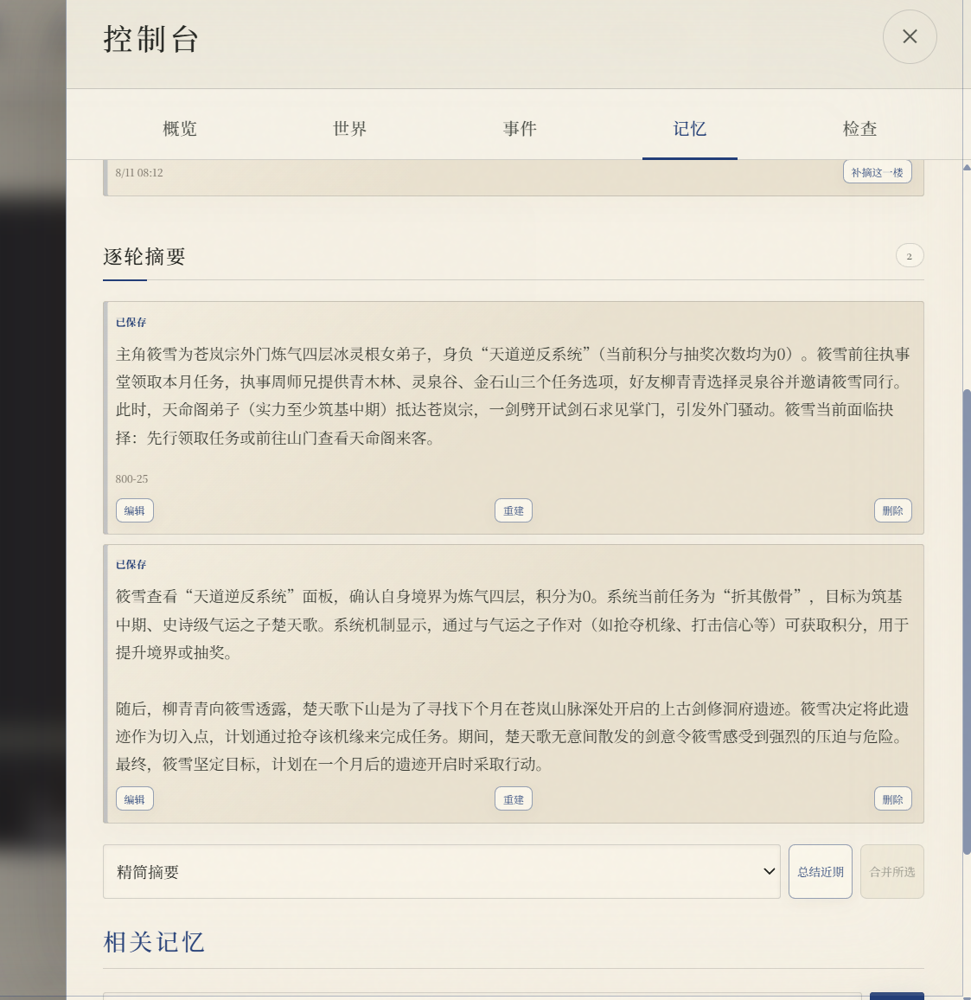
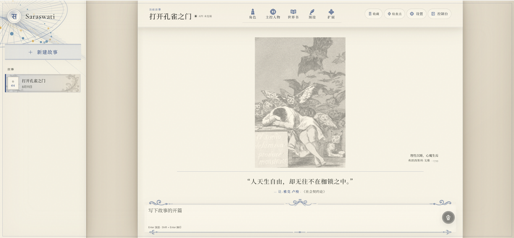
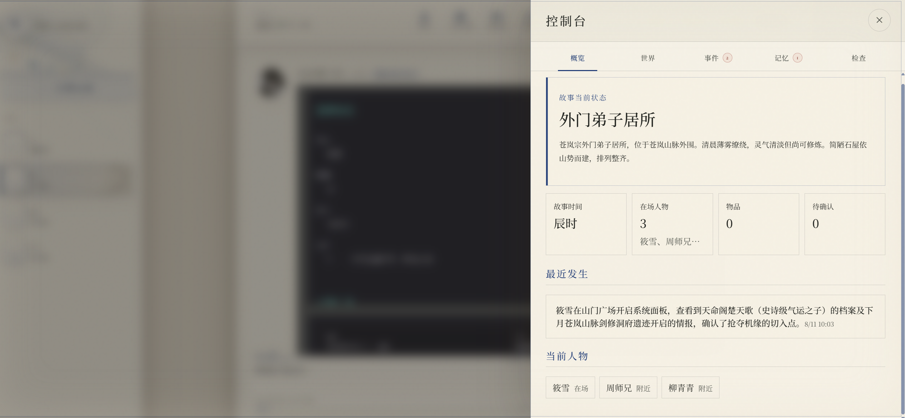
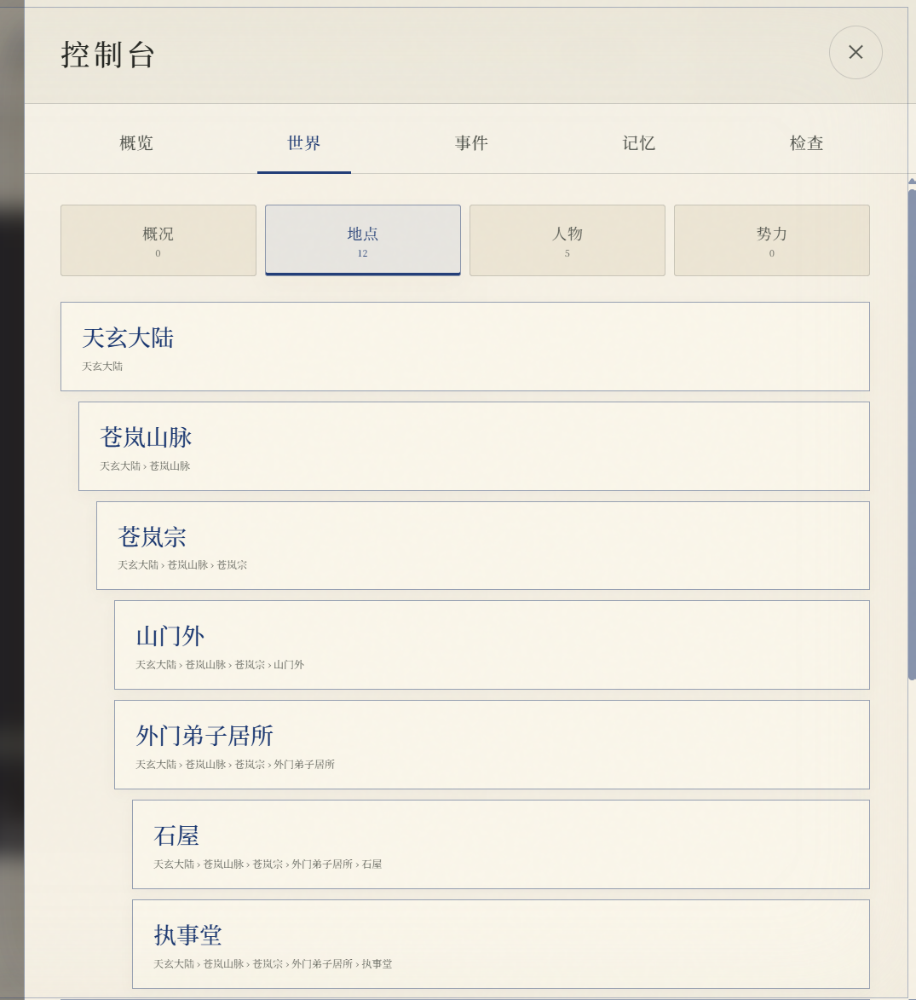
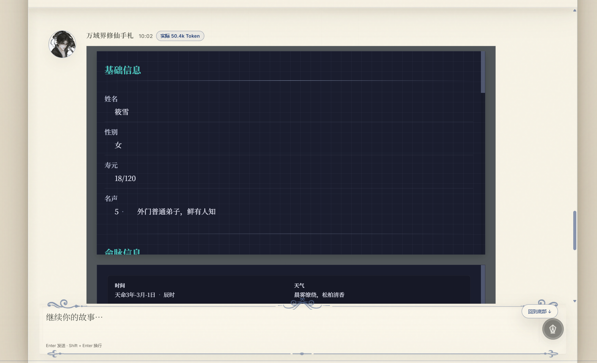
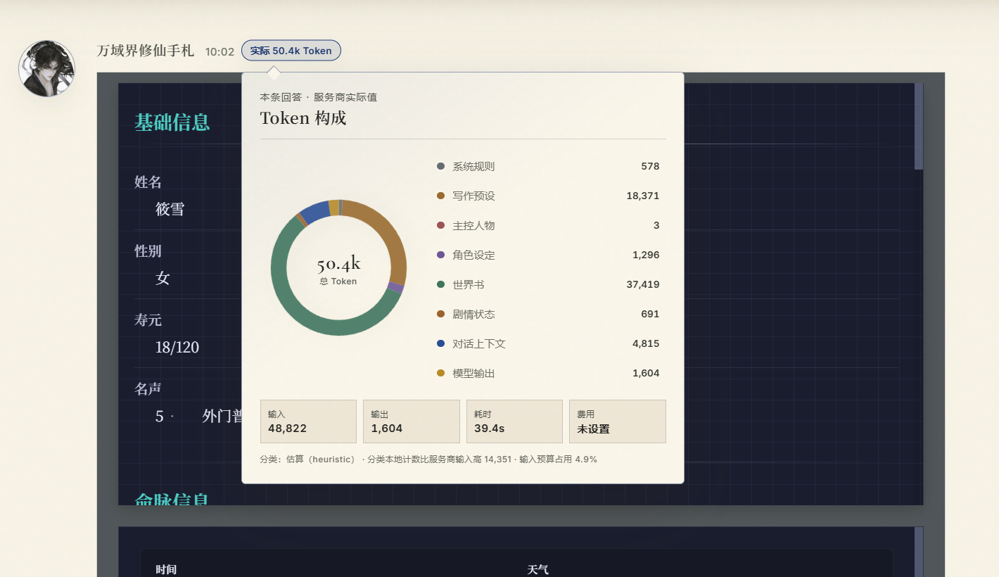
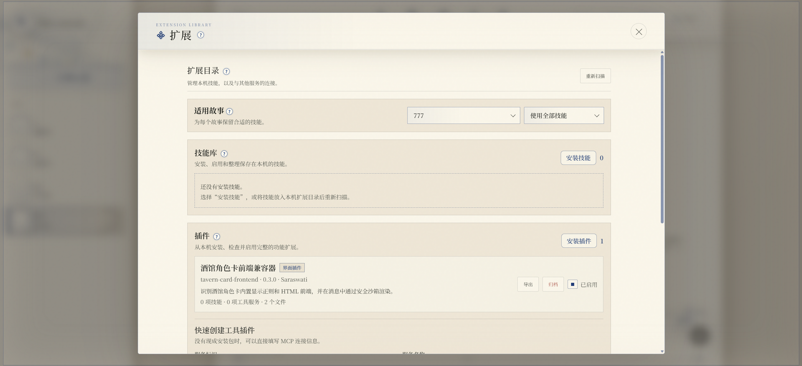
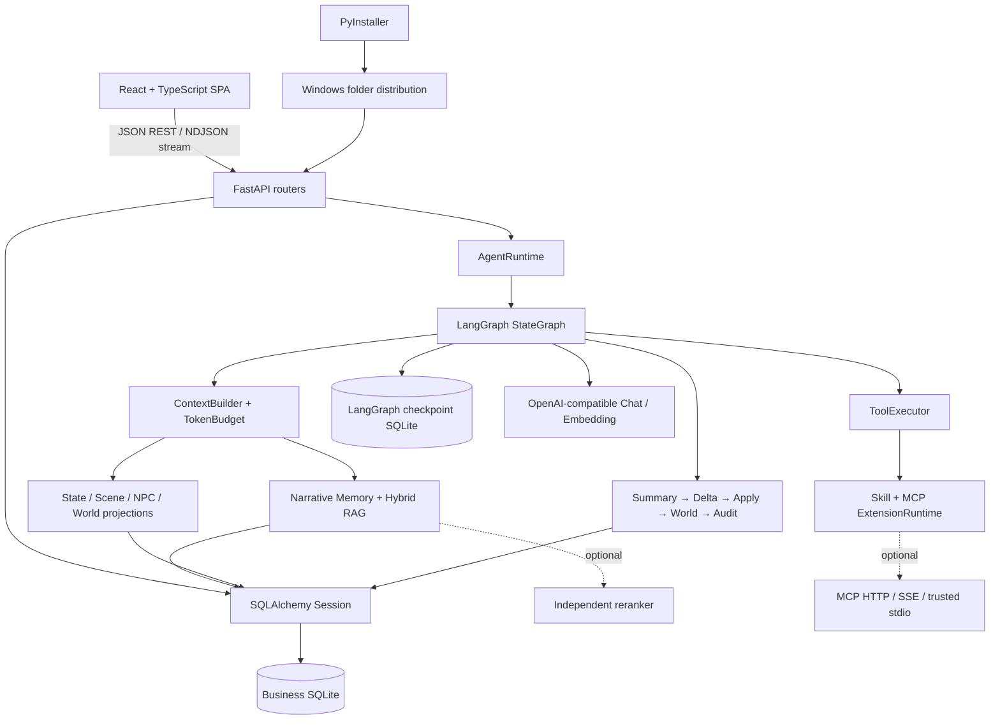
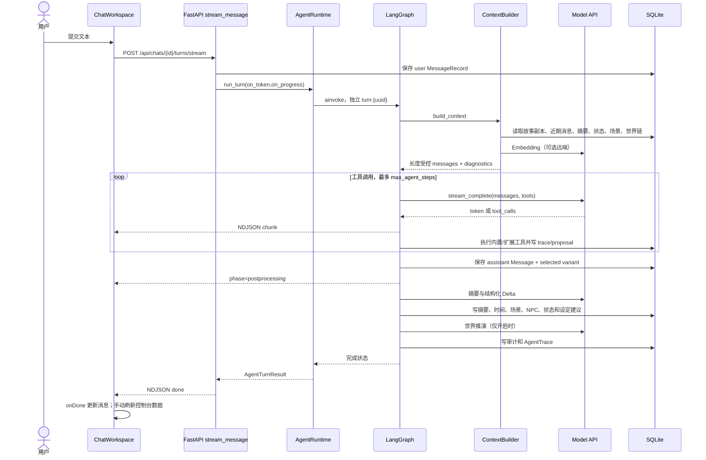

# Saraswati Agent

[](https://github.com/maximilian-2778/saraswati-agent/actions/workflows/ci.yml)


Saraswati Agent 是一个本地长篇角色扮演 Agent。它用 LangGraph 编排模型、工具、分层记忆、剧情状态和生成后审计，重点处理长篇故事中的记忆、状态和设定演化。

项目面向 Windows 单机使用，支持 OpenAI-compatible 模型接口。聊天、设定、记忆和 Agent 检查点保存在本地，模型服务由用户自行选择。

## 1. 项目重点

### 长篇剧情记忆，减少重要剧情遗忘和时间线跳跃

- 近期消息直接保留，窗口外剧情由楼层摘要、章节摘要和篇章摘要组成摘要森林，控制上下文长度。
- 混合 RAG 综合 Embedding、关键词、重要度和时间因素，召回结果带有来源和分数，并按相关性和重要度分层注入。
- 消息原文发生变化时，旧摘要和相关派生记录失效。

<p align="center">
  
</p>

### 自带工具台，增添场景与人物

- 支持在游玩过程中随时增添人物与场景，并维护介绍、属性和持有物品。
- 支持手动和自动整理摘要，可选精简摘要或详细摘要。
- 支持手动或自动进行世界推演，推进当前对话场景之外的势力、事件和传闻。

<table>
  <tr>
    <td></td>
    <td></td>
  </tr>
  <tr>
    <td colspan="2"></td>
  </tr>
</table>

### 随着故事演变改变角色卡与世界书

- 每个故事将启用的角色卡和世界书生成一个副本，剧情推进会影响副本内容，当前故事使用的设定始终来自该副本。
- 剧情中的重大设定变化只作用于当前故事副本，不修改原始模板。
- 可以自动采用确凿无疑的变化；其他变化会进入审批流程。

<p align="center">
  
</p>


### 可视化 Token 消耗与可回放的事件历史

- LangGraph 编排上下文构建、模型调用、工具循环和生成后处理。
- 每轮记录模型耗时、Token、工具调用、状态建议、审计结果和后处理阶段。
- 状态和设定变更保留事件记录，支持审批、撤销和回放；摘要支持编辑、重建和删除。

<p align="center">
  
</p>

### 兼容酒馆原版格式，支持 Skill 与插件

- 支持 OpenAI Chat Completions、Structured Output 和 Embeddings 兼容接口。
- 兼容 Saraswati 原生插件、Codex 风格插件清单、MCP 工具插件和 HTML 前端插件。
- 兼容酒馆原版的角色卡、世界书和预设，并附带兼容自带前端角色卡的插件。

<p align="center">
  
</p>

## 2. 快速开始

### Windows 用户

下载 [Saraswati Agent v1.4.0 Windows x64](https://github.com/maximilian-2778/saraswati-agent/releases/download/v1.4.0/Saraswati-Agent-v1.4.0-windows-x64.zip)，完整解压后运行 `SaraswatiAgent.exe`。

程序会启动本地 FastAPI 服务并打开浏览器。打包版本不要求安装 Python、Node.js，也不需要分别启动前后端。

用户数据保存在 `%LOCALAPPDATA%\Saraswati Agent`，升级程序不会覆盖该目录。

### 开发环境

要求 Python 3.13、Node.js 22 或兼容版本。

```powershell
py -3.13 -m venv .venv
.\.venv\Scripts\python.exe -m pip install -r requirements.txt

Set-Location frontend
npm ci
Set-Location ..
```

启动后端和前端时使用两个终端：

```powershell
.\scripts\start_backend.ps1
.\scripts\start_frontend.ps1
```

开发地址默认为：

- 前端：`http://localhost:5180`
- 后端：`http://127.0.0.1:8010`
- 健康检查：`http://127.0.0.1:8010/api/health`

## 3. 使用模型

在客户端右上角打开“设置”，填写：

- API 地址
- API Key
- 对话模型名称

Embedding 模型可以单独配置。留空时，记忆服务使用本地 96 维哈希向量；生成回复仍需要连接对话模型。

未配置模型时可以管理角色、世界书和故事资料。发送消息前必须完成模型连接检查，系统不会生成占位回复。

API Key 保存在本机 `settings.json` 中，读取接口只返回配置状态和末四位提示。该文件未做系统级加密，请勿上传或分享。

## 4. 一轮对话如何运行

1. 前端通过 `POST /api/chats/{id}/turns/stream` 提交消息。
2. FastAPI 保存用户消息，创建本轮 `AgentRuntime` 上下文。
3. `ContextBuilder` 读取故事副本、世界书、近期原文、摘要、RAG 记忆、场景、时间线和精确状态。
4. `TokenBudgetManager` 根据模型 Token 计数器裁剪上下文，保留最新用户请求。
5. LangGraph 调用模型；模型可以请求记忆、状态、场景或扩展工具。
6. 工具循环结束后保存助手消息和当前候选回复。
7. 后处理节点生成楼层摘要，提取并应用剧情 Delta，更新时间线、场景、NPC、状态和设定建议。
8. 可选的世界推演完成后，审计器检查回复和结构化状态，前端收到 `done` 事件。

## 5. 总体架构

### 架构风格

本地单进程、前后端分离开发、同进程分发的模块化单体。FastAPI 提供 API 和生产静态文件；业务数据与 LangGraph 检查点分别使用两个 SQLite 文件；模型、reranker 和 MCP 可以作为外部服务。



### 模块划分与职责

| 模块 | 责任 | 主要依赖 |
| --- | --- | --- |
| `backend/routers` | HTTP 契约、资源查找、状态码、流事件 | schemas、controller helpers、services |
| `backend/services/agent.py` | Runtime 生命周期、依赖装配、运行图、候选后处理 | graph、model、extensions、domain services |
| `backend/services/agent_graph.py` | 节点、条件边、工具循环、持久化和后处理顺序 | context、memory、delta、world、audit |
| `backend/services/context.py` | 组装角色、主控、世界书、近期消息、摘要、RAG、状态和扩展提示 | models、memory、token budget、world engine |
| `backend/services/narrative_memory.py` | 楼层摘要、章节/篇章压缩、指纹有效性和覆盖诊断 | memory、messages、variants |
| `backend/services/narrative_delta*.py` | 提取结构化变化、去重和应用 | state、timeline、roleplay graph、setting evolution |
| `backend/services/setting_evolution.py` | 设定建议、审批、撤销和基线回放 | story copies、variants |
| `backend/services/world_engine.py` | 势力、事件、传闻和趋势的快照链 | messages、variants、LLM |
| `backend/extensions` | Skill/Plugin 安装、权限、MCP 工具和前端资源边界 | filesystem、MCP SDK |
| `backend/models.py` | 31 个业务持久化模型 | SQLAlchemy |
| `frontend/src/api.ts` | API 契约和 NDJSON 流解析 | Fetch |
| `frontend/src/hooks/useWorkspaceQueries.ts` | 启动数据和故事快照查询 | TanStack Query |
| `frontend/src/pages/ChatWorkspace.tsx` | 主工作区、流式 UI 和局部数据刷新 | api、components、query client |
| `frontend/src/MemoryHub.tsx` | 摘要、场景、NPC、时间线、状态、设定变更和轨迹 UI | api、types |

### 模块依赖原则

- Router 处理 HTTP 契约，不承载模型算法。
- LangGraph 状态只保存可序列化的 ID、文本和计数；数据库 Session、模型客户端和回调放在 `AgentGraphContext`。
- 模板跨故事复用，故事副本负责运行时内容；事件记录负责回放，当前表负责查询。
- MCP 工具通过协议调用；前端插件运行在 `sandbox="allow-scripts"` iframe 中，并通过权限化 `postMessage` RPC 与宿主通信。

### 典型对话调用链



## 6. 数据流和权威来源

1. 前端通过 `/api` 请求 FastAPI，浏览器不直接访问模型服务。
2. Pydantic 校验请求，SQLAlchemy Session 在请求范围内读写业务 SQLite。
3. 模型配置来自环境变量和本机 `settings.json`；设置接口只返回密钥状态和末四位。
4. 精确状态来自已批准 `state_changes` 的回放，`state_entries` 是查询投影。
5. 当前角色、主控和世界书内容来自基线与有效 `setting_changes` 的回放，模板保持不变。
6. 候选相关记录带 `variant_id`；上下文和投影只使用当前有效候选。
7. 长期记忆向量以 JSON 保存于 SQLite，查询时在进程内全量评分；可选地把候选交给独立 reranker。

### 数据库文件

| 文件 | 内容 |
| --- | --- |
| `saraswati_v1.db` | 故事、消息、模板、摘要、记忆、状态、事件、审计和扩展配置 |
| `langgraph_checkpoints.db` | LangGraph 节点运行状态；不保存数据库 Session、模型客户端或 API Key |

## 7. 技术栈

| 层次 | 技术 | 项目中的作用 |
| --- | --- | --- |
| API | FastAPI、Pydantic | REST、NDJSON、请求校验和 OpenAPI |
| 业务数据 | SQLAlchemy 2.x、SQLite | 持久化、事务和本地部署 |
| 数据库演进 | Alembic | 0001～0008 迁移、旧库接管和 CI 检查 |
| Agent 编排 | LangGraph StateGraph | 条件工具循环、后处理节点和 checkpoint |
| 模型适配 | httpx、tenacity | OpenAI-compatible 对话、流式响应、Embedding、重试和降级 |
| 记忆 | 自研摘要森林、混合 RAG、可选 reranker | 长篇历史压缩、召回和来源追踪 |
| Token | tiktoken、启发式计数器 | 上下文预算、裁剪和诊断 |
| 前端 | React 19、TypeScript、TanStack Query、Vite | 工作区、资料库、控制台和流式交互 |
| 扩展 | MCP SDK、PyYAML、iframe sandbox | Skill、Plugin、MCP 工具和前端扩展 |
| 分发 | PyInstaller | Windows 目录式发布包 |
| 验证 | pytest、FastAPI TestClient、TypeScript build | API、Agent、迁移、扩展和前端回归 |

## 8. 关键设计

### 候选回复与派生数据

候选切换会影响摘要、记忆、场景、NPC、状态和设定。系统使用 `variant_id` 限定候选作用域，并用来源消息指纹检测改写。有效事件重新回放后，当前表得到新的投影。

### 摘要森林与上下文预算

每轮助手回复生成一个 L0 摘要叶子，章节和篇章摘要保存子节点 ID。消息改写导致叶子失效时，祖先摘要停止注入，系统下钻到仍然可信的节点。上下文预算器按模型 tokenizer 或启发式计数器裁剪消息，保留最新请求。

### 设定演化

Delta 提取器只能引用当前故事中的目标 ID 和允许字段。`critical`、置信度至少 `0.9` 且有证据的变更可以自动采用；其他重大变化进入待审批状态。审批、撤销、候选切换和消息改写都会触发基线回放。

### 扩展边界

Skill 采用按需读取；Plugin 工具使用命名空间；MCP 通过 Streamable HTTP、SSE 或显式信任的 stdio 接入；前端插件运行于 sandbox iframe。当前仍缺少插件签名、MCP OAuth 和 stdio 常驻进程监督。

## 9. 验证结果

当前仓库的固定回归结果：

- `pytest`：71 passed，15 warnings。
- `scripts/run_rag_eval.py`：5 个固定样例，Recall@1=1.0，MRR=1.0。
- `scripts/run_long_context_eval.py`：300 轮合成输入，原始估算 103,224 tokens，最终估算 12,000 tokens，最新请求保留。
- `npm run build`：TypeScript 检查通过，Vite 转换 94 个模块。

这些结果用于回归验证。长上下文脚本当前报告 `system_prompt_truncated=true`，只验证预算上限和最新请求保留。RAG 样例规模有限，脚本使用合成输入和 heuristic tokenizer，不能推导线上质量、吞吐或延迟。

运行测试：

```powershell
.\.venv\Scripts\python.exe -m pytest -q
.\.venv\Scripts\python.exe scripts\run_rag_eval.py
.\.venv\Scripts\python.exe scripts\run_long_context_eval.py

Set-Location frontend
npm run build
```

## 10. 数据库迁移和 Windows 打包

后端启动时会自动将业务数据库升级到最新 Alembic revision。手动检查：

```powershell
.\.venv\Scripts\python.exe -m alembic current
.\.venv\Scripts\python.exe -m alembic upgrade head
.\.venv\Scripts\python.exe -m alembic check
```

修改 ORM 模型后，先生成候选迁移，再检查字段改名、数据搬迁、SQLite 表重建和 downgrade 顺序：

```powershell
.\.venv\Scripts\python.exe -m alembic revision --autogenerate -m "change description"
```

构建 Windows 目录式发布包前，先关闭正在运行的打包客户端：

```powershell
.\scripts\build_windows.ps1
```

## 11. 项目范围

当前版本面向本地单用户工作流，暂不包含：

- 用户账号、远程鉴权、云同步和多租户。
- 分布式任务队列、容器编排和高并发部署。
- 通用向量数据库、模型训练和移动端。
- 自动更新、正式安装器、代码签名以及 macOS/Linux 发布包。
- 完整 SillyTavern 运行时兼容。

已知工程限制：SQLite 写并发有限；RAG 使用 JSON 向量和 Python 全表评分；API Key 仍保存在本机明文文件；当前缺少浏览器 E2E、真实模型供应商矩阵、负载测试和安全渗透测试。

## 12. 项目结构

```text
backend/
  main.py                 FastAPI 应用工厂和生产静态文件挂载
  api.py                  路由汇总
  routers/                系统、模板、故事、记忆、状态和扩展接口
  providers/              OpenAI-compatible 模型适配器
  extensions/             Skill、Plugin 和 MCP 运行时
  models.py               SQLAlchemy 业务模型
  services/
    agent.py              Runtime 生命周期和 LangGraph 入口
    agent_graph.py        节点、条件边和工作流定义
    context.py             上下文组装和 Token 预算
    narrative_memory.py   摘要森林和长期记忆选择
    narrative_delta.py    结构化剧情变化提取
    narrative_delta_apply.py
                           Delta 去重和投影更新
    setting_evolution.py  故事级设定审批和回放
    world_engine.py       世界状态推演

alembic/
  versions/               数据库迁移 revision

frontend/src/
  pages/                  聊天工作区
  components/             消息、资料库、设置、插件和控制台组件
  hooks/                  查询和界面偏好 hooks
  MemoryHub.tsx           故事记忆与状态控制台

tests/                    后端和 Agent 回归测试
scripts/                  启动、评估和 Windows 构建脚本
```

## 13. 文档

- [总体架构](docs/ARCHITECTURE.md)
- [设置中心](docs/SETTINGS.md)
- [项目规格](docs/PROJECT_SPEC.md)
- [扩展说明](docs/EXTENSIONS.md)
- [前端插件](docs/frontend-plugins.md)
- [路线图](docs/ROADMAP.md)
- [更新记录](CHANGELOG.md)
