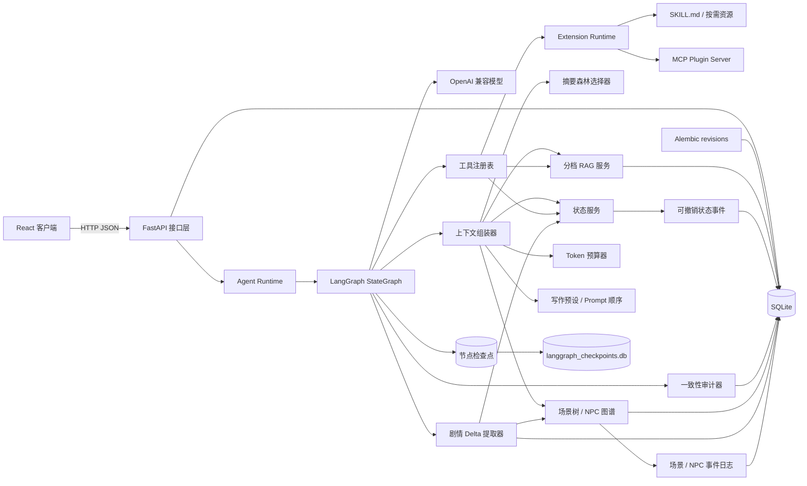
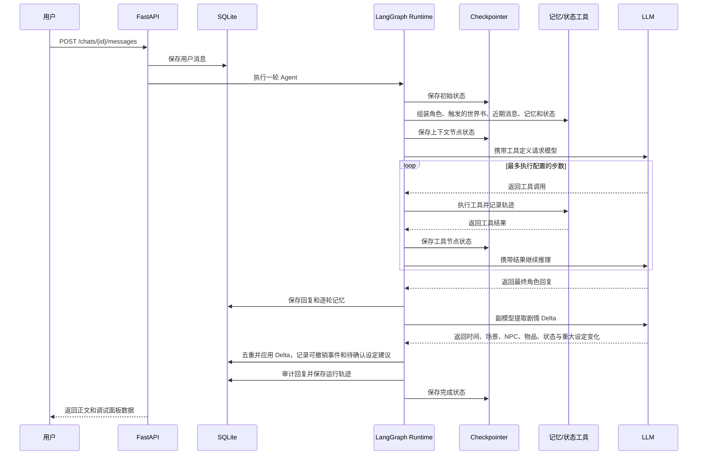

# 系统架构

## 整体结构

## 后端分层

- `api`：很薄的公开入口，只汇总各领域路由。
- `routers`：系统、模板、故事、记忆和状态各自处理 HTTP 请求，公开 URL 保持稳定。
- `controller_helpers`：多个领域共同使用的查询、复制和事件回放函数。
- `services`：记忆检索、状态变更、审计、上下文组装和 Agent 执行等业务逻辑。
- `services/presets`：默认写作提示词、SillyTavern JSON 导入导出和兼容字段转换。
- `services/agent_graph`：LangGraph 状态、节点和条件边；图状态只保存可序列化数据。
- `services/agent`：工作流生命周期和原有 `run_turn` 接口；数据库会话、模型和工具执行器通过运行时上下文注入。
- `llm`：与厂商无关的模型协议和演示实现；`providers` 保存具体供应商适配器。
- `models`：SQLAlchemy 持久化模型，是数据库内部的数据表示。
- `schemas`：Pydantic 请求和响应模型，是 API 对外的数据契约。
- `database`：数据库引擎、单次请求的 Session 生命周期和旧库兼容补齐逻辑。
- `migrations`：启动时执行 Alembic upgrade，并接管没有 revision 的旧数据库。
- `config`：带安全默认值的环境配置。
- `extensions`：Skill 隔离安装、三级按需读取、故事级权限、来源/用量记录，以及 MCP Plugin 三传输协议适配；第三方代码不在主进程内导入。
- `world_engine`：故事级势力、持续事件、风声与趋势推演；不可变快照通过消息指纹和前态摘要组成可验证状态链。

## 一轮对话的数据流

## 数据权威规则

- LangGraph 检查点只保存消息、记录 ID、执行步数和路由结果；数据库会话、模型客户端、回调和 API Key 不进入图状态。
- Skill 目录只把名称和描述加入常规上下文，完整 `SKILL.md` 与附属资源在模型调用 `activate_skill` 后才读取；显式 `/skill-id` 会在本轮预载主说明。
- Plugin 工具统一增加 `<plugin-id>__` 命名空间，不能覆盖内置工具；MCP 连接通过 Streamable HTTP、SSE 或显式信任的 stdio 惰性建立，单个 Plugin 不可用时不会阻止主应用启动。
- 故事级 Skill 白名单在提示注入、工具 schema 和执行入口重复校验，数据库记录是权威来源。
- 每轮使用独立 `thread_id`，节点状态写入单独的本地 SQLite 文件；剧情长期记忆仍由业务数据库管理。

- 原始消息允许用户显式改写；摘要叶子的原文指纹用于检测改写，而不是静默同步旧摘要。
- 角色和世界书模板是跨故事复用的母版；故事只绑定创建时复制出的私有快照。
- 一个故事可以拥有多个角色和多个世界书副本；角色全部注入，世界书按关键词和优先级选择性注入。
- 写作预设只决定额外提示词的内容和插入顺序，不修改生成参数。角色、主控人物、世界书、记忆和聊天记录仍由标准上下文组装器从当前故事读取。
- 故事副本可以随剧情演化，模板的修改或删除不会覆盖已有故事内容。
- 角色、主控和世界书副本的重大变化记录在 `setting_changes` 中；模板始终不变，故事副本是按有效候选事件重放得到的当前投影。
- 只有明确完成、长期有效且不可逆的高置信度 `critical` 变化会自动采用；其他 `major` 变化必须由用户确认。提取器只能引用现有副本 ID 和允许字段，不能创建新设定目标。
- 设定变化绑定回复 `variant_id`。切换候选、改写消息、删除后续剧情或创建分支时会恢复字段基线并重放当前分支的已批准事件；用户手动编辑副本会成为不依赖候选的权威事件。
- 每轮回复生成 L0 摘要叶子；压缩节点保存子节点 ID，形成可验证的摘要森林。
- 窗口外历史优先由最高完整节点表示；若子叶失效，祖先不再注入并自动下钻到可信旁支。
- 修复操作删除失效分支及对应向量索引，再依据新原文重建，避免 RAG 偷渡旧剧情。
- 时间锚点从显式故事时间中提取；生成后 Delta 会补齐场景、NPC、物品和精确状态。
- 场景树和 NPC 图谱是叙事知识结构；Agent 可自动维护，但上下文只选择当前场景、在场人物、核心人物和查询命中的节点。
- 场景和 NPC 当前表是事件投影；更新与删除先写入带来源哈希的事件，消息改写后清空投影并重放有效事件。
- 每轮 Delta 绑定用户/助手消息共同指纹；前端可以明确区分有效变化和已被改写淘汰的旧变化。
- 已批准的状态变更事件是精确数值的真源；`state_entries` 是按事件顺序重放生成的当前投影。
- Agent 产生的状态变化默认自动采用，每次修改保留独立事件，可撤销并按剩余事件重建当前投影；用户手动建立的建议仍可先确认。
- 记忆是可检索的叙事证据，不作为精确数值的最终依据。
- 审计、记忆和状态建议在可能时保留来源消息 ID。

## RAG 策略

MVP 将向量以 JSON 保存到 SQLite，不要求额外安装向量数据库。一次查询会扩展为事件、人物关系、物品状态和计划悬念等视角，再综合 Embedding 余弦相似度、关键词重合、重要度和时间因素。近期原文及失效分支会被排除；本地初排候选可发送给独立 `/rerank` 服务，高分结果注入清洗后的来源原文，普通结果只注入摘要。精排失败会自动保留本地顺序。

## 数据库演进

应用使用 Alembic 管理业务数据库结构。空数据库从 `0001` 依次升级到 head；已有业务表但没有 `alembic_version` 的旧库会先由兼容逻辑补齐 0.9 基线字段和数据，再 stamp 到 `0001`。后续模型变化必须增加 revision，不能继续在启动函数中追加临时 `ALTER TABLE`。

SQLite 迁移启用 batch mode。自动生成脚本提交前需要检查字段改名、约束变化、数据搬迁和 downgrade 顺序；CI 通过 `alembic check` 发现 ORM Metadata 与迁移 head 的差异。
