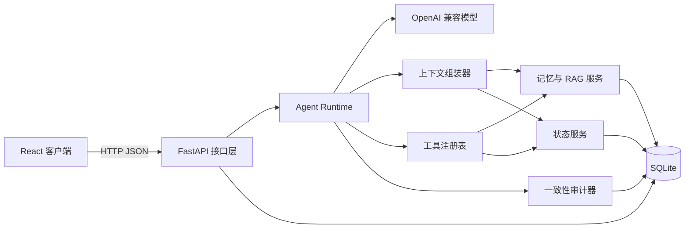
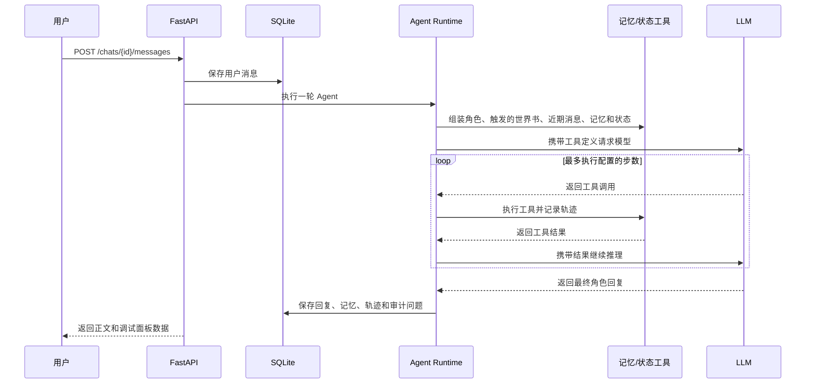

# 系统架构

## 整体结构

## 后端分层

- `api`：HTTP 路由和依赖注入，负责验证请求，并把服务结果转换成公开数据模型。
- `services`：记忆检索、状态变更、审计、上下文组装和 Agent 执行等业务逻辑。
- `llm`：与厂商无关的模型接口，以及 OpenAI 兼容实现和演示实现。
- `models`：SQLAlchemy 持久化模型，是数据库内部的数据表示。
- `schemas`：Pydantic 请求和响应模型，是 API 对外的数据契约。
- `database`：数据库引擎和单次请求的 Session 生命周期。
- `config`：带安全默认值的环境配置。

## 一轮对话的数据流

## 数据权威规则

- 原始消息是历史记录，除未来明确的编辑流程外不会被修改。
- 角色档案是每轮固定注入的人物约束；世界书按关键词和优先级选择性注入。
- 已批准的结构化状态是精确数值的唯一事实来源。
- 待审核建议在用户批准前不会改变当前状态。
- 记忆是可检索的叙事证据，不作为精确数值的最终依据。
- 审计、记忆和状态建议在可能时保留来源消息 ID。

## RAG 策略

MVP 将向量以 JSON 保存到 SQLite，不要求额外安装向量数据库。检索同时考虑 Embedding 余弦相似度、关键词重合、重要度和时间因素。它适合本地简历项目的数据量；后续扩展可以替换为 Qdrant 或 PostgreSQL + pgvector。

## 数据库演进

完整 1.0 使用新的 `saraswati_v1.db`，保留教程阶段的旧数据库。第一版干净结构由 SQLAlchemy 创建；1.0 表结构稳定后，再用 Alembic 管理后续数据库迁移。
