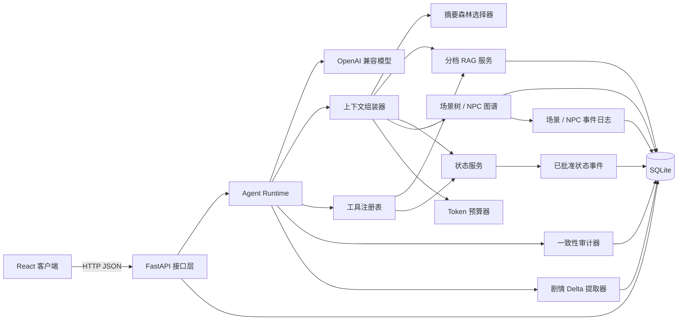
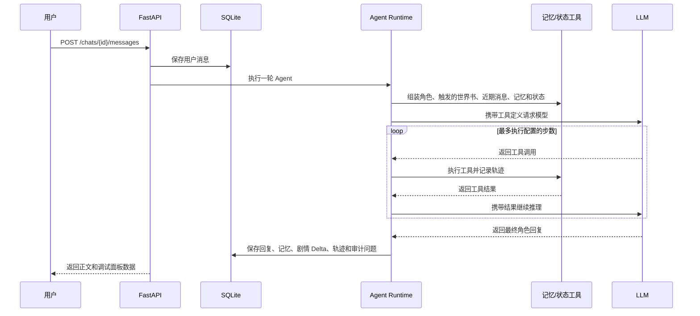

# 系统架构

## 整体结构

## 后端分层

- `api`：很薄的公开入口，只汇总各领域路由。
- `routers`：按系统、模板、故事、记忆和状态分组，公开 URL 保持稳定。
- `controllers`：处理 HTTP 请求、依赖注入和响应转换；后续新增接口应先放入对应领域模块。
- `services`：记忆检索、状态变更、审计、上下文组装和 Agent 执行等业务逻辑。
- `llm`：与厂商无关的模型接口，以及 OpenAI 兼容实现和演示实现。
- `models`：SQLAlchemy 持久化模型，是数据库内部的数据表示。
- `schemas`：Pydantic 请求和响应模型，是 API 对外的数据契约。
- `database`：数据库引擎和单次请求的 Session 生命周期。
- `config`：带安全默认值的环境配置。

## 一轮对话的数据流

## 数据权威规则

- 原始消息允许用户显式改写；摘要叶子的原文指纹用于检测改写，而不是静默同步旧摘要。
- 角色和世界书模板是跨故事复用的母版；故事只绑定创建时复制出的私有快照。
- 一个故事可以拥有多个角色和多个世界书副本；角色全部注入，世界书按关键词和优先级选择性注入。
- 故事副本可以随剧情演化，模板的修改或删除不会覆盖已有故事内容。
- 每轮回复生成 L0 摘要叶子；压缩节点保存子节点 ID，形成可验证的摘要森林。
- 窗口外历史优先由最高完整节点表示；若子叶失效，祖先不再注入并自动下钻到可信旁支。
- 修复操作删除失效分支及对应向量索引，再依据新原文重建，避免 RAG 偷渡旧剧情。
- 时间锚点从显式故事时间中提取，物品、NPC、场景和悬念复用带审批的结构化状态账本。
- 场景树和 NPC 图谱是叙事知识结构；Agent 可自动维护，但上下文只选择当前场景、在场人物、核心人物和查询命中的节点。
- 场景和 NPC 当前表是事件投影；更新与删除先写入带来源哈希的事件，消息改写后清空投影并重放有效事件。
- 每轮 Delta 绑定用户/助手消息共同指纹；前端可以明确区分有效变化和已被改写淘汰的旧变化。
- 已批准的状态变更事件是精确数值的真源；`state_entries` 是按事件顺序重放生成的当前投影。
- 待审核建议在用户批准前不会改变当前状态。
- 记忆是可检索的叙事证据，不作为精确数值的最终依据。
- 审计、记忆和状态建议在可能时保留来源消息 ID。

## RAG 策略

MVP 将向量以 JSON 保存到 SQLite，不要求额外安装向量数据库。一次查询会扩展为事件、人物关系、物品状态和计划悬念等视角，再综合 Embedding 余弦相似度、关键词重合、重要度和时间因素。近期原文及失效分支会被排除；本地初排候选可发送给独立 `/rerank` 服务，高分结果注入清洗后的来源原文，普通结果只注入摘要。精排失败会自动保留本地顺序。

## 数据库演进

完整 1.0 使用新的 `saraswati_v1.db`，保留教程阶段的旧数据库。第一版干净结构由 SQLAlchemy 创建；1.0 表结构稳定后，再用 Alembic 管理后续数据库迁移。
